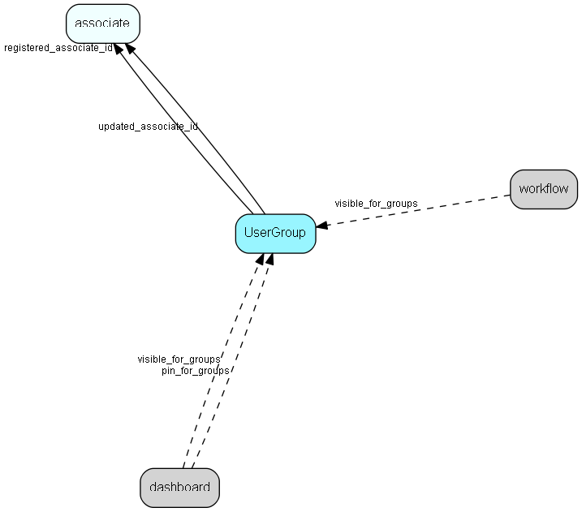

# UserGroup Table (59)

Secondary user groups

## Fields

| Name | Description | Type | Null |
|------|-------------|------|:----:|
|UserGroup\_id|Primary key|PK| |
|name|UserGroup name|String(239)| |
|rank|Rank order |UShort|&#x25CF;|
|tooltip|Tooltip or other description|String(254)|&#x25CF;|
|deleted|0 -&gt; record is active 1 -&gt; record is &apos;deleted&apos; and should not be shown in lists|UShort|&#x25CF;|
|type|0 = department, other values = ? (workgroup, role, …)|UShort|&#x25CF;|
|registered|Registered when|UtcDateTime| |
|registered\_associate\_id|Registered by whom|FK [associate](associate.md)| |
|updated|Last updated when|UtcDateTime| |
|updated\_associate\_id|Last updated by whom|FK [associate](associate.md)| |
|updatedCount|Number of updates made to this record|UShort| |

[!include[details](./includes/usergroup.md)]

## Indexes

| Fields | Types | Description |
|--------|-------|-------------|
|UserGroup\_id |PK |Clustered, Unique |
|name |String(239) |Unique |

## Relationships

| Table|  Description |
|------|-------------|
|[AmountClassGroupLink](amountclassgrouplink.md)  |User group link table for AmountClass, for MDO item hiding |
|[appointment](appointment.md)  |Tasks, appointments, followups, phone calls; and documents (document_id != 0). An appointment always has a corresponding record in VisibleFor specifying who may see this.  |
|[associate](associate.md)  |Employees, resources and other users - except for External persons |
|[AssociateGroupLink](associategrouplink.md)  |User group link table for Associate, for MDO item hiding |
|[BusinessGroupLink](businessgrouplink.md)  |User group link table for Business, for MDO item hiding |
|[CategoryGroupLink](categorygrouplink.md)  |User group link table for Category, for MDO item hiding |
|[ComptrGroupLink](comptrgrouplink.md)  |User group link table for Comptr, for MDO item hiding |
|[contact](contact.md)  |Companies and Organizations.   This table features a special record containing information about the contact that owns the database.   |
|[ContIntGroupLink](contintgrouplink.md)  |User group link table for ContInt, for MDO item hiding |
|[CountryGroupLink](countrygrouplink.md)  |User group link table for Country, for MDO item hiding |
|[CreditedGroupLink](creditedgrouplink.md)  |User group link table for Credited, for MDO item hiding |
|[CurrencyGroupLink](currencygrouplink.md)  |User group link table for Currency, for MDO item hiding |
|[dashboard](dashboard.md)  |Describes a dashboard |
|[DeliveryTermsGroupLink](deliverytermsgrouplink.md)  |User group link table for DeliveryTerms, for MDO item hiding |
|[DeliveryTypeGroupLink](deliverytypegrouplink.md)  |User group link table for DeliveryType, for MDO item hiding |
|[DocTmplGroupLink](doctmplgrouplink.md)  |User group link table for DocTmpl, for MDO item hiding |
|[EjCategoryGroupLink](ejcategorygrouplink.md)  |User group link table for EjCategory, for mass handling ej_category members |
|[ErpConnectionAccess](erpconnectionaccess.md)  |Access control for Erp Connections |
|[ExtAppGroupLink](extappgrouplink.md)  |User group link table for ExtApp, for MDO item hiding |
|[form](form.md)  |A form which can be published on a webpage and submitted by visitors |
|[IntentGroupLink](intentgrouplink.md)  |User group link table for Intent, for MDO item hiding |
|[MrMrsGroupLink](mrmrsgrouplink.md)  |User group link table for MrMrs, for MDO item hiding |
|[PaymentTermsGroupLink](paymenttermsgrouplink.md)  |User group link table for PaymentTerms, for MDO item hiding |
|[PaymentTypeGroupLink](paymenttypegrouplink.md)  |User group link table for PaymentType, for MDO item hiding |
|[PersIntGroupLink](persintgrouplink.md)  |User group link table for PersInt, for MDO item hiding |
|[PersPosGroupLink](persposgrouplink.md)  |User group link table for PersPos, for MDO item hiding |
|[PMembTypeGroupLink](pmembtypegrouplink.md)  |User group link table for PMembType, for MDO item hiding |
|[PriceUnitGroupLink](priceunitgrouplink.md)  |User group link table for PriceUnit, for MDO item hiding |
|[PriorityGroupLink](prioritygrouplink.md)  |User group link table for Priority, for MDO item hiding |
|[ProbGroupLink](probgrouplink.md)  |User group link table for Prob, for MDO item hiding |
|[ProductCategoryGroupLink](productcategorygrouplink.md)  |User group link table for ProductCategory, for MDO item hiding |
|[ProductFamilyGroupLink](productfamilygrouplink.md)  |User group link table for ProductFamily, for MDO item hiding |
|[ProductTypeGroupLink](producttypegrouplink.md)  |User group link table for ProductType, for MDO item hiding |
|[project](project.md)  |Projects |
|[ProjStatusGroupLink](projstatusgrouplink.md)  |User group link table for ProjStatus, for MDO item hiding |
|[ProjTypeGroupLink](projtypegrouplink.md)  |User group link table for ProjType, for MDO item hiding |
|[QuoteApprReasonGroupLink](quoteapprreasongrouplink.md)  |User group link table for QuoteApprReason, for MDO item hiding |
|[QuoteConnectionAccess](quoteconnectionaccess.md)  |Access control for Quote Connections |
|[QuoteDenyReasonGroupLink](quotedenyreasongrouplink.md)  |User group link table for QuoteDenyReason, for MDO item hiding |
|[ReasonGroupLink](reasongrouplink.md)  |User group link table for Reason, for MDO item hiding |
|[ReasonSoldGroupLink](reasonsoldgrouplink.md)  |User group link table for ReasonSold, for MDO item hiding |
|[ReasonStalledGroupLink](reasonstalledgrouplink.md)  |Link table for ReasonStalled, for MDO item hiding |
|[RejectReasonGroupLink](rejectreasongrouplink.md)  |User group link table for Comptr, for MDO item hiding |
|[relations](relations.md)  |Instance of a relation, in principle between any two records, as long as they are defined in RelationDefinition. All instances of relations are held in this table; their definitions are in the RelDef table (RelDef + RelTarg define which relations you can have, this table contains the relations the user has actually entered). From 6.1 all links between appointments, sales and documents are also stored in this tabel. |
|[RelDefGroupLink](reldefgrouplink.md)  |User group link table for RelDef, for MDO item hiding |
|[sale](sale.md)  |Sales  For every Sale record edited through the SuperOffice GUI, a copy of the current version of the record will be saved in the SaleHist table. This also applies to editing done through the SaleModel COM interface, but not to editing done through the OLE DB Provider or other channels.   |
|[SaleHist](salehist.md)  |Mirror image of the Sale table, providing a full transaction history. Every time you edit a sale, the current record of the sale is also saved here.  |
|[SaleTypeCatGroupLink](saletypecatgrouplink.md)  |User group link table for SaleTypeCat, for MDO item hiding |
|[SaleTypeGroupLink](saletypegrouplink.md)  |User group link table for SaleType, for MDO item hiding |
|[SalutationGroupLink](salutationgrouplink.md)  |User group link table for Salutation, for MDO item hiding |
|[SearchCatGroupLink](searchcatgrouplink.md)  |User group link table for SearchCat, for MDO item hiding |
|[selection](selection.md)  |Selections |
|[SORPublishGroupLink](sorpublishgrouplink.md)  |Link table used for filtering reports by user group |
|[SourceGroupLink](sourcegrouplink.md)  |User group link table for Source, for MDO item hiding |
|[StakeholderRoleGroupLink](stakeholderrolegrouplink.md)  |User group link table for StakeholderRole, for MDO item hiding |
|[SubscriptionUnitGroupLink](subscriptionunitgrouplink.md)  |User group link table for SubscriptionUnit, for MDO item hiding |
|[SuperListColumnSize](superlistcolumnsize.md)  |Stores the relative size (in percent) or in characters of a column in a SuperList |
|[TagsGroupLink](tagsgrouplink.md)  |User group link table for Tags, for MDO item hiding |
|[target\_assignment\_info](target-assignment-info.md)  |Linking associate, company or user group target and other information with target values |
|[target\_revision\_history](target-revision-history.md)  |Revision history info in case the original target group or assignment info was deleted |
|[TaskGroupLink](taskgrouplink.md)  |User group link table for Task, for MDO item hiding |
|[TaskMenuGroupLink](taskmenugrouplink.md)  |User group link table for TaskMenu, for MDO item hiding |
|[ticket\_type](ticket-type.md)  |A ticket (request) type |
|[UDefFieldGL](udeffieldgl.md)  |User group link table for UDefField, for MDO item hiding |
|[UDListGroupLink](udlistgrouplink.md)  |User group link table for UDList, for MDO item hiding. Note - MDO mode for userdefinede lists are either turned on or off, you may not have it on for one userdefined list and off for the others. |
|[UserGroupLink](usergrouplink.md)  |Link table between associate and usergroup, specifies secondary group membership. From SIX an associate may belong to more than one usergroup. Http://techdoc.superoffice.com has more information about how roles are implemented. |
|[VisibleFor](visiblefor.md)  |Visible for rights, who may see this appointment/document, sale,  salehist or selection |
|[workflow](workflow.md)  |SuperOffice specific info about a workflow |

## Replication Flags

* Replicate changes DOWN from central to satellites and travellers.
* Replicate changes UP from satellites and travellers back to central.
* Copy to satellite and travel prototypes.

## Security Flags

* No access control via user's Role.

