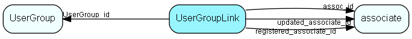

# UserGroupLink Table (60)

Link table between associate and usergroup, specifies secondary group membership. From SIX an associate may belong to more than one usergroup. Http;//techdoc.superoffice.com has more information about how roles are implemented.

## Fields

| Name | Description | Type | Null |
|------|-------------|------|:----:|
|UserGroupLink\_id|Primary key|PK| |
|assoc\_id|Link to associate|FK [associate](associate.md)| |
|UserGroup\_id|Link to group|FK [UserGroup](usergroup.md)| |
|remark|Comment on why the assoc is linked to the group|String(254)|&#x25CF;|
|validFrom|When the membership becomes valid|DateTime|&#x25CF;|
|validTo|Last datetime this membership is valid|DateTime|&#x25CF;|
|registered|Registered when|UtcDateTime| |
|registered\_associate\_id|Registered by whom|FK [associate](associate.md)| |
|updated|Last updated when|UtcDateTime| |
|updated\_associate\_id|Last updated by whom|FK [associate](associate.md)| |
|updatedCount|Number of updates made to this record|UShort| |
|encryptedCheck|Encrypted data, to detect unwanted changes|String(254)|&#x25CF;|

[!include[details](./includes/usergrouplink.md)]

## Indexes

| Fields | Types | Description |
|--------|-------|-------------|
|UserGroupLink\_id |PK |Clustered, Unique |
|assoc\_id |FK |Index |
|UserGroup\_id |FK |Index |

## Relationships

| Table|  Description |
|------|-------------|
|[associate](associate.md)  |Employees, resources and other users - except for External persons |
|[UserGroup](usergroup.md)  |Secondary user groups |

## Replication Flags

* Replicate changes DOWN from central to satellites and travellers.
* Replicate changes UP from satellites and travellers back to central.
* Copy to satellite and travel prototypes.

## Security Flags

* Sentry controls access to items in this table using user's Role and data rights matrix on the table's parent.

