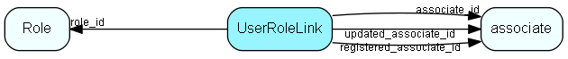

# UserRoleLink Table (192)

Link between user role and user

## Fields

| Name | Description | Type | Null |
|------|-------------|------|:----:|
|UserRoleLink\_id|Primary key|PK| |
|associate\_id|Link to associate|FK [associate](associate.md)| |
|role\_id|Link to Role|FK [Role](role.md)| |
|linkType|Reserved for future extension, not used|UInt| |
|encryptedCheck|Encrypted data, to detect unwanted changes|String(254)| |
|registered|Registered when|UtcDateTime| |
|registered\_associate\_id|Registered by whom|FK [associate](associate.md)| |
|updated|Last updated when|UtcDateTime| |
|updated\_associate\_id|Last updated by whom|FK [associate](associate.md)| |
|updatedCount|Number of updates made to this record|UShort| |

[!include[details](./includes/userrolelink.md)]

## Indexes

| Fields | Types | Description |
|--------|-------|-------------|
|UserRoleLink\_id |PK |Clustered, Unique |

## Relationships

| Table|  Description |
|------|-------------|
|[associate](associate.md)  |Employees, resources and other users - except for External persons |
|[Role](role.md)  |User roles for role-based security, names and tooltips are in LocaleText. For more information regarding role based security, see http://techdoc.superoffice.com |

## Replication Flags

* Replicate changes DOWN from central to satellites and travellers.
* Replicate changes UP from satellites and travellers back to central.
* Copy to satellite and travel prototypes.

## Security Flags

* Sentry controls access to items in this table using user's Role and data rights matrix on the table's parent.

