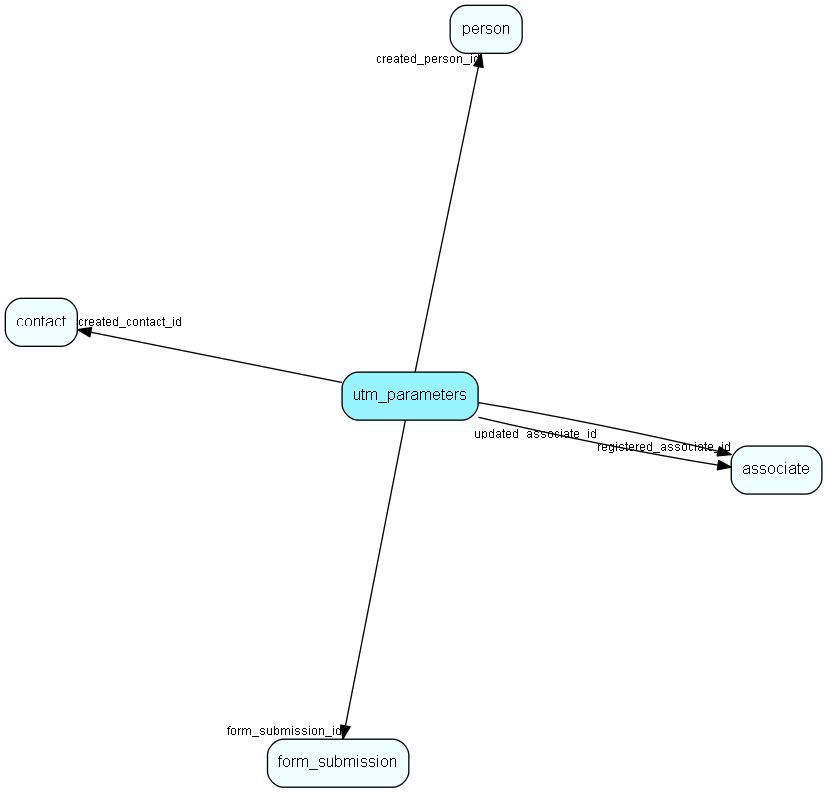

# utm\_parameters Table (539)

Table for utm parameters collected from visits and formsubmissions

## Fields

| Name | Description | Type | Null |
|------|-------------|------|:----:|
|utm\_parameters\_id|Primary key|PK| |
|created\_person\_id|Id of the created person|FK [person](person.md)|&#x25CF;|
|created\_contact\_id|Id of the created contact|FK [contact](contact.md)|&#x25CF;|
|form\_submission\_id|Id of formsubmission|FK [form_submission](form-submission.md)|&#x25CF;|
|firsttouch\_source|First touch UTM Source|String(255)|&#x25CF;|
|firsttouch\_medium|First touch UTM Medium|String(255)|&#x25CF;|
|firsttouch\_campaign|First touch UTM Campaign|String(255)|&#x25CF;|
|firsttouch\_term|First touch UTM Term|String(255)|&#x25CF;|
|firsttouch\_content|First touch UTM Content|String(255)|&#x25CF;|
|firsttouch\_referrerdomain|First touch referrer domain|String(255)|&#x25CF;|
|firsttouch\_when|First touch date|DateTime|&#x25CF;|
|source|UTM Source|String(255)|&#x25CF;|
|medium|UTM Medium|String(255)|&#x25CF;|
|campaign|UTM Campaign|String(255)|&#x25CF;|
|term|UTM Term|String(255)|&#x25CF;|
|content|UTM Content|String(255)|&#x25CF;|
|referrerdomain|Referrer domain|String(255)|&#x25CF;|
|when|Date of the visit or form submission|DateTime|&#x25CF;|
|registered|Registered when|UtcDateTime| |
|registered\_associate\_id|Registered by whom|FK [associate](associate.md)| |
|updated|Last updated when|UtcDateTime| |
|updated\_associate\_id|Last updated by whom|FK [associate](associate.md)| |
|updatedCount|Number of updates made to this record|UShort| |

[!include[details](./includes/utm-parameters.md)]

## Indexes

| Fields | Types | Description |
|--------|-------|-------------|
|utm\_parameters\_id |PK |Clustered, Unique |
|created\_person\_id |FK |Index |
|created\_contact\_id |FK |Index |
|form\_submission\_id |FK |Index |

## Relationships

| Table|  Description |
|------|-------------|
|[associate](associate.md)  |Employees, resources and other users - except for External persons |
|[contact](contact.md)  |Companies and Organizations. |
|[form\_submission](form-submission.md)  |A form submission |
|[person](person.md)  |Persons |

## Replication Flags

* None

## Security Flags

* No access control via user's Role.

