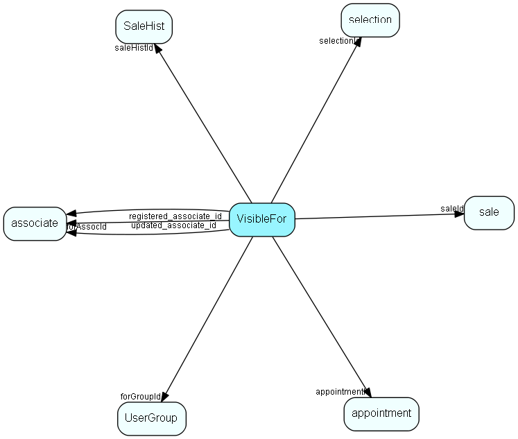

# VisibleFor Table (196)

Visible for rights, who may see this appointment/document, sale,  salehist or selection

## Fields

| Name | Description | Type | Null |
|------|-------------|------|:----:|
|VisibleFor\_id|Primary key|PK| |
|tableId|ID of table this right is valid for|TableNumber| |
|recordId|ID of row this right applies to|RecordId| |
|forAll|1 = visible to all, 0 = not visible to all|Id| |
|forGroupId|0 = not visible to any particular group, or ID of group|FK [UserGroup](usergroup.md)| |
|forAssocId|0 = not visible to any particular associate, or ID of associate|FK [associate](associate.md)| |
|encryptedCheck|Encrypted checksum field, to prevent tampering|String(254)| |
|appointmentId|Shortcut: appointment id, if tableId = appointment; to give faster joins|FK [appointment](appointment.md)|&#x25CF;|
|saleId|Shortcut: sale id, if tableId = sale to give faster joins|FK [sale](sale.md)|&#x25CF;|
|saleHistId|Shortcut: salehist id, if tableId = salehist to give faster joins|FK [SaleHist](salehist.md)|&#x25CF;|
|selectionId|Shortcut: selection id, if tableId = selection to give faster joins|FK [selection](selection.md)|&#x25CF;|
|registered|Registered when|UtcDateTime| |
|registered\_associate\_id|Registered by whom|FK [associate](associate.md)| |
|updated|Last updated when|UtcDateTime| |
|updated\_associate\_id|Last updated by whom|FK [associate](associate.md)| |
|updatedCount|Number of updates made to this record|UShort| |

[!include[details](./includes/visiblefor.md)]

## Indexes

| Fields | Types | Description |
|--------|-------|-------------|
|VisibleFor\_id |PK |Clustered, Unique |
|appointmentId |FK |Index |
|saleId |FK |Index |
|saleHistId |FK |Index |
|selectionId |FK |Index |
|recordId, tableId |RecordId, TableNumber |Index |
|tableId, recordId, forAll, forGroupId, forAssocId |TableNumber, RecordId, Id, FK, FK |Index |

## Relationships

| Table|  Description |
|------|-------------|
|[appointment](appointment.md)  |Tasks, appointments, followups, phone calls; and documents (document_id != 0). An appointment always has a corresponding record in VisibleFor specifying who may see this.  |
|[associate](associate.md)  |Employees, resources and other users - except for External persons |
|[sale](sale.md)  |Sales  For every Sale record edited through the SuperOffice GUI, a copy of the current version of the record will be saved in the SaleHist table. This also applies to editing done through the SaleModel COM interface, but not to editing done through the OLE DB Provider or other channels.   |
|[SaleHist](salehist.md)  |Mirror image of the Sale table, providing a full transaction history. Every time you edit a sale, the current record of the sale is also saved here.  |
|[selection](selection.md)  |Selections |
|[UserGroup](usergroup.md)  |Secondary user groups |

## Replication Flags

* Area Management controlled table. Contents replicated to satellites and traveller databases.
* Replicate changes UP from satellites and travellers back to central.
* Copy to satellite and travel prototypes.

## Security Flags

* No access control via user's Role.

