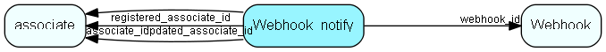

# Webhook\_notify Table (524)

Notification recipients for webhook failure events. Each row defines one recipient (associate or ad-hoc email) that should be notified when a webhook fails.

## Fields

| Name | Description | Type | Null |
|------|-------------|------|:----:|
|webhook\_notify\_id|Primary key|PK| |
|webhook\_id|The webhook that this notification is for|FK [Webhook](webhook.md)| |
|associate\_id|Associate to notify. If set, email_recipient is ignored.|FK [associate](associate.md)|&#x25CF;|
|email\_recipient|Ad-hoc email address to notify. Used when associate_id is 0.|String(239)|&#x25CF;|
|registered|Registered when|UtcDateTime| |
|registered\_associate\_id|Registered by whom|FK [associate](associate.md)| |
|updated|Last updated when|UtcDateTime| |
|updated\_associate\_id|Last updated by whom|FK [associate](associate.md)| |
|updatedCount|Number of updates made to this record|UShort| |

[!include[details](./includes/webhook-notify.md)]

## Indexes

| Fields | Types | Description |
|--------|-------|-------------|
|webhook\_id |FK |Index |
|associate\_id |FK |Index |

## Relationships

| Table|  Description |
|------|-------------|
|[associate](associate.md)  |Employees, resources and other users - except for External persons |
|[Webhook](webhook.md)  |Webhook URL to call when events occur in the client or in NetServer. Also tracks call+error statistics. |

## Replication Flags

* None

## Security Flags

* No access control via user's Role.

