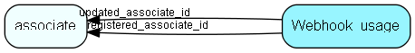

# Webhook\_usage Table (509)

Webhook usage statistics - tracks call+error statistics. Same primary key as the webhook.

## Fields

| Name | Description | Type | Null |
|------|-------------|------|:----:|
|webhook\_usage\_id|Primary key|PK| |
|total\_calls|Number of times webhook has been invoked since registered. For statistical purposes.|Int| |
|total\_errors|Number of times webhook has returned error since registered. For statistical purposes.|Int| |
|consecutive\_errors|Number of consecutive errors. Reset to 0 when an non-error is received. If too many errors, webhook.state is changed to TooManyErrors(3) to deactivate webhook.|Int| |
|last\_error|Most recent error message received from target. HTTP Headers + body. To help with debugging webhooks.|String(4000)|&#x25CF;|
|registered|Registered when|UtcDateTime| |
|registered\_associate\_id|Registered by whom|FK [associate](associate.md)| |
|updated|Last updated when|UtcDateTime| |
|updated\_associate\_id|Last updated by whom|FK [associate](associate.md)| |
|updatedCount|Number of updates made to this record|UShort| |

[!include[details](./includes/webhook-usage.md)]

## Indexes

| Fields | Types | Description |
|--------|-------|-------------|
|webhook\_usage\_id |PK |Clustered, Unique |

## Relationships

| Table|  Description |
|------|-------------|
|[associate](associate.md)  |Employees, resources and other users - except for External persons |

## Replication Flags

* None

## Security Flags

* No access control via user's Role.

