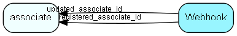

# Webhook Table (508)

Webhook URL to call when events occur in the client or in NetServer. Also tracks call+error statistics.

## Fields

| Name | Description | Type | Null |
|------|-------------|------|:----:|
|webhook\_id|Primary key|PK| |
|name|Name to identify this webhook. Does not have to be unique.|String(400)| |
|events|Comma separated list of event names that this hook responds to: &apos;contact.created,person.changed,project.deleted&apos;|String(4000)| |
|target\_url|Destination to POST event info to. URL for webhooks. Id for CRM scripts|String(4000)| |
|type|Name of plugin that handles this webhook. &apos;webhook&apos; for HTTP POST notifications, &apos;crmscript&apos; for script invocations.|String(100)| |
|application\_token|Application that registered this hook. If set, then other apps won&apos;t be able to modify this record|String(200)|&#x25CF;|
|headers|Hook specific additional HTTP headers that should be added to HTTP request, stored as JSON blob|Clob|&#x25CF;|
|properties|Hook specific additional data that should be added to payload, stored as JSON blob|Clob|&#x25CF;|
|secret|Shared secret key used for generating SHA256 HMAC signature, so that receiver can verify that call came from this server|String(400)|&#x25CF;|
|state|Webhook status - should we post events to the URL? 1=Active, 2=Stopped or 3=TooManyErrors|Enum [WebhookState](enums/webhookstate.md)| |
|registered|Registered when|UtcDateTime| |
|registered\_associate\_id|Registered by whom|FK [associate](associate.md)| |
|updated|Last updated when|UtcDateTime| |
|updated\_associate\_id|Last updated by whom|FK [associate](associate.md)| |
|updatedCount|Number of updates made to this record|UShort| |
|errors\_email|Email address to send error message to when this webhook state changes to too-many errors.|String(239)|&#x25CF;|

[!include[details](./includes/webhook.md)]

## Indexes

| Fields | Types | Description |
|--------|-------|-------------|
|webhook\_id |PK |Clustered, Unique |

## Relationships

| Table|  Description |
|------|-------------|
|[associate](associate.md)  |Employees, resources and other users - except for External persons |

## Replication Flags

* None

## Security Flags

* No access control via user's Role.

