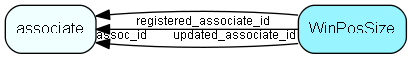

# WinPosSize Table (208)

Stores the position and size of each window, so they can be shown in the same place again

## Fields

| Name | Description | Type | Null |
|------|-------------|------|:----:|
|WinPosSize\_id|Primary key|PK| |
|assoc\_id|Owning associate|FK [associate](associate.md)| |
|owner|The dialog, panel or whatever that owns this record|String(254)| |
|state|Normal = 0, Maximized = 1, Minimized = 2|Enum [ShowWindowState](enums/showwindowstate.md)| |
|extraId|Spare ID, not yet in use|Id|&#x25CF;|
|leftX|X of origin, left edge of widget|Int| |
|upperY|Y of origin, upper edge of widget|Int| |
|width|The width of the widget|Int| |
|height|The height of the widget|Int| |
|extraInfo|Extra information - show state, or whatever is required|String(254)| |
|registered|Registered when|UtcDateTime| |
|registered\_associate\_id|Registered by whom|FK [associate](associate.md)| |
|updated|Last updated when|UtcDateTime| |
|updated\_associate\_id|Last updated by whom|FK [associate](associate.md)| |
|updatedCount|Number of updates made to this record|UShort| |

[!include[details](./includes/winpossize.md)]

## Indexes

| Fields | Types | Description |
|--------|-------|-------------|
|WinPosSize\_id |PK |Clustered, Unique |
|assoc\_id, owner |FK, String(254) |Index |

## Relationships

| Table|  Description |
|------|-------------|
|[associate](associate.md)  |Employees, resources and other users - except for External persons |

## Replication Flags

* Area Management controlled table. Contents replicated to satellites and traveller databases.
* Replicate changes UP from satellites and travellers back to central.
* Copy to satellite and travel prototypes.

## Security Flags

* No access control via user's Role.

