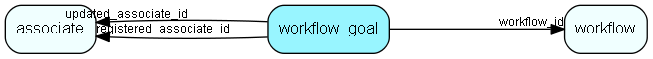

# workflow\_goal Table (513)

A set of goals related to a workflow. Some goals will have search criterias associated with it to determine if the goal has been reached.

## Fields

| Name | Description | Type | Null |
|------|-------------|------|:----:|
|workflow\_goal\_id|Primary key|PK| |
|workflow\_id|The flow this goal belongs to|FK [workflow](workflow.md)|&#x25CF;|
|goal\_type|A goal that will conclude the workflow|Enum [WorkflowGoalType](enums/workflowgoaltype.md)|&#x25CF;|
|registered|Registered when|UtcDateTime| |
|registered\_associate\_id|Registered by whom|FK [associate](associate.md)| |
|updated|Last updated when|UtcDateTime| |
|updated\_associate\_id|Last updated by whom|FK [associate](associate.md)| |
|updatedCount|Number of updates made to this record|UShort| |

[!include[details](./includes/workflow-goal.md)]

## Indexes

| Fields | Types | Description |
|--------|-------|-------------|
|workflow\_goal\_id |PK |Clustered, Unique |

## Relationships

| Table|  Description |
|------|-------------|
|[associate](associate.md)  |Employees, resources and other users - except for External persons |
|[workflow](workflow.md)  |SuperOffice specific info about a workflow |

## Replication Flags

* None

## Security Flags

* Sentry controls access to items in this table using user's Role and data rights matrix on the table's parent.

