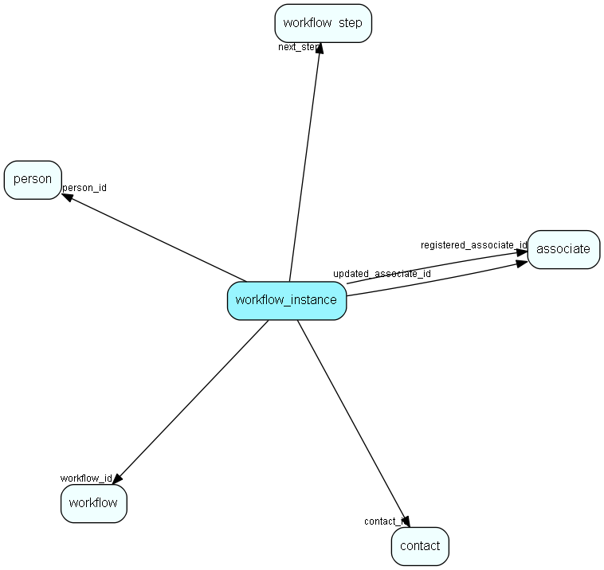

# workflow\_instance Table (512)

A set of properties related to the workflow instance of one participant going through the flow

## Fields

| Name | Description | Type | Null |
|------|-------------|------|:----:|
|workflow\_instance\_id|Primary key|PK| |
|workflow\_id|The flow this instance belongs to|FK [workflow](workflow.md)|&#x25CF;|
|status|Status of the workflow instance|Enum [WorkflowInstanceStatus](enums/workflowinstancestatus.md)|&#x25CF;|
|person\_id|Person ID of person going through the flow|FK [person](person.md)|&#x25CF;|
|contact\_id|Contact ID of contact contact going through the flow|FK [contact](contact.md)|&#x25CF;|
|variables|Instance data and variables|Clob|&#x25CF;|
|registered|Registered when|UtcDateTime| |
|registered\_associate\_id|Registered by whom|FK [associate](associate.md)| |
|updated|Last updated when|UtcDateTime| |
|updated\_associate\_id|Last updated by whom|FK [associate](associate.md)| |
|updatedCount|Number of updates made to this record|UShort| |
|current\_step|Next step to be executed when conditions are met|FK [workflow_step](workflow-step.md)|&#x25CF;|
|wait\_until|Don&apos;t evaluate conditions until given time (set by a waiting step, and status Suspended). An event may change the wait_until or status to Running.|DateTime|&#x25CF;|
|last\_communication\_step|Last completed step with email/sms to customer|FK [workflow_step](workflow-step.md)|&#x25CF;|
|dropout\_reason|Reason for dropout/failure|String(255)|&#x25CF;|
|step\_started|The currently executing step was started at this time|DateTime|&#x25CF;|
|step\_level|Some steps have multiple levels, this indicates what level is reached|Int|&#x25CF;|

[!include[details](./includes/workflow-instance.md)]

## Indexes

| Fields | Types | Description |
|--------|-------|-------------|
|workflow\_instance\_id |PK |Clustered, Unique |
|person\_id |FK |Index |
|contact\_id |FK |Index |

## Relationships

| Table|  Description |
|------|-------------|
|[associate](associate.md)  |Employees, resources and other users - except for External persons |
|[contact](contact.md)  |Companies and Organizations.   This table features a special record containing information about the contact that owns the database.   |
|[person](person.md)  |Persons in a company or an organizations. All associates have a corresponding person record |
|[s\_shipment\_addr](s-shipment-addr.md)  |Addresses that are ready to be sent in a shipment. |
|[workflow](workflow.md)  |SuperOffice specific info about a workflow |
|[workflow\_step](workflow-step.md)  |A set of steps related to a workflow. |

## Replication Flags

* None

## Security Flags

* Sentry controls access to items in this table using user's Role and data rights matrix on the table's parent.

