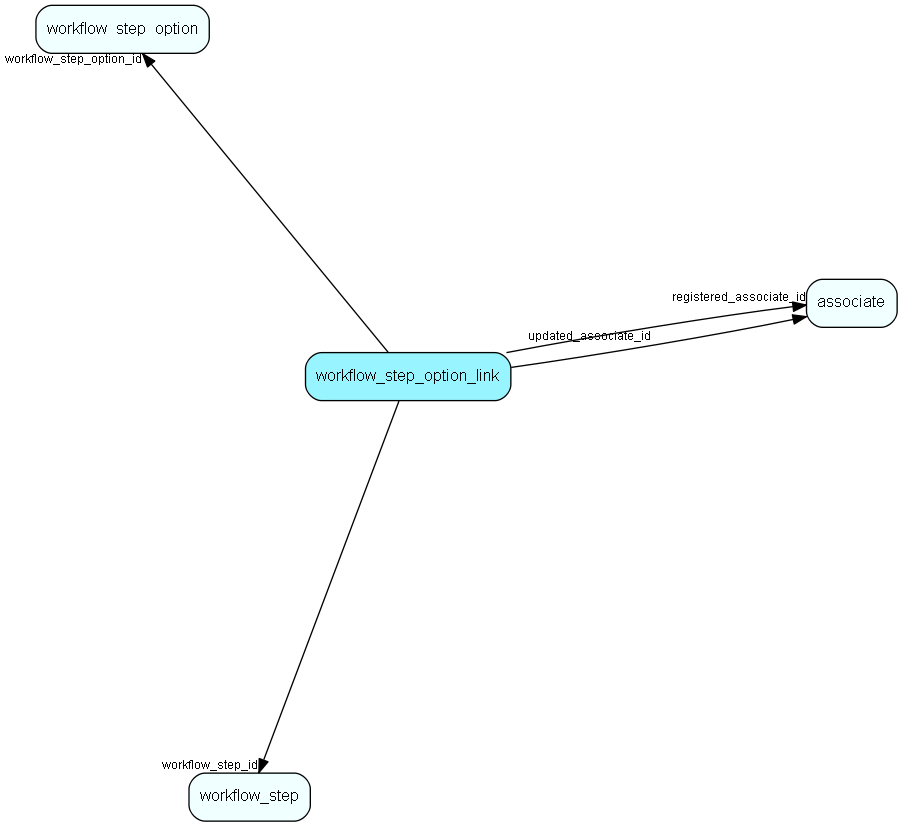

# workflow\_step\_option\_link Table (517)

Link steps to other steps through step options

## Fields

| Name | Description | Type | Null |
|------|-------------|------|:----:|
|workflow\_step\_option\_link\_id|Primary key|PK| |
|workflow\_step\_option\_id|The workflow step option to connect to|FK [workflow_step_option](workflow-step-option.md)|&#x25CF;|
|workflow\_step\_id|A workflow step connected to the option|FK [workflow_step](workflow-step.md)|&#x25CF;|
|registered|Registered when|UtcDateTime| |
|registered\_associate\_id|Registered by whom|FK [associate](associate.md)| |
|updated|Last updated when|UtcDateTime| |
|updated\_associate\_id|Last updated by whom|FK [associate](associate.md)| |
|updatedCount|Number of updates made to this record|UShort| |
|Rank|Step order|Int|&#x25CF;|

[!include[details](./includes/workflow-step-option-link.md)]

## Indexes

| Fields | Types | Description |
|--------|-------|-------------|
|workflow\_step\_option\_link\_id |PK |Clustered, Unique |

## Relationships

| Table|  Description |
|------|-------------|
|[associate](associate.md)  |Employees, resources and other users - except for External persons |
|[workflow\_step](workflow-step.md)  |A set of steps related to a workflow. |
|[workflow\_step\_option](workflow-step-option.md)  |Some steps can have optional child &apos;flows&apos;, a new series of steps |

## Replication Flags

* None

## Security Flags

* Sentry controls access to items in this table using user's Role and data rights matrix on the table's parent.

