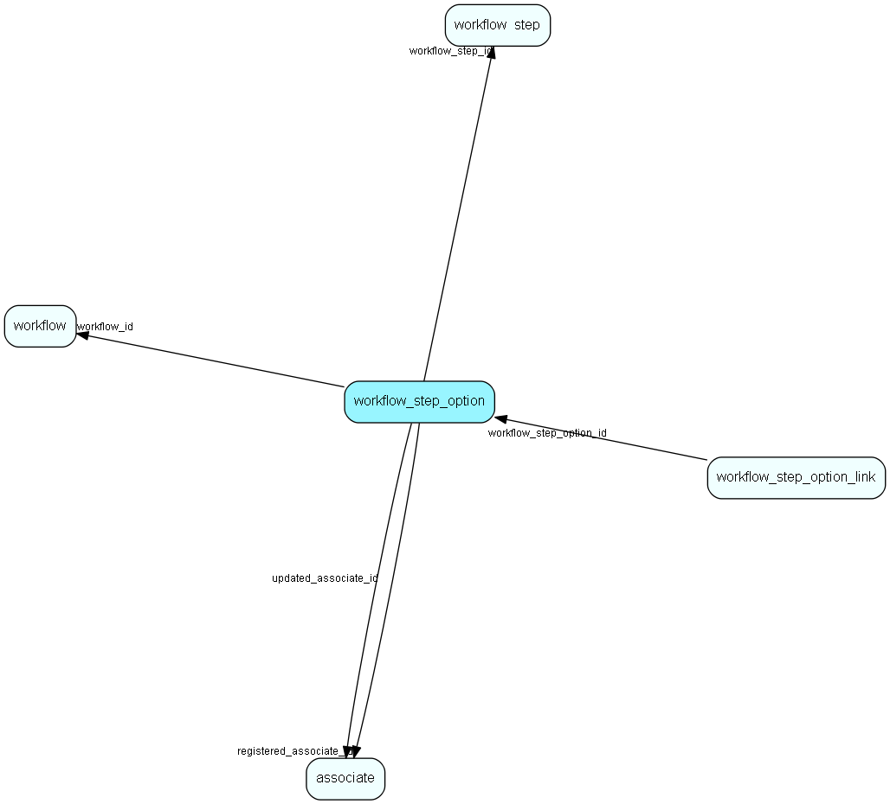

# workflow\_step\_option Table (516)

Some steps can have optional child &apos;flows&apos;, a new series of steps

## Fields

| Name | Description | Type | Null |
|------|-------------|------|:----:|
|workflow\_step\_option\_id|Primary key|PK| |
|workflow\_step\_id|The workflow step this instance belongs to|FK [workflow_step](workflow-step.md)|&#x25CF;|
|name|The name of this option|String(255)|&#x25CF;|
|rank|The rank of this option|Int|&#x25CF;|
|registered|Registered when|UtcDateTime| |
|registered\_associate\_id|Registered by whom|FK [associate](associate.md)| |
|updated|Last updated when|UtcDateTime| |
|updated\_associate\_id|Last updated by whom|FK [associate](associate.md)| |
|updatedCount|Number of updates made to this record|UShort| |
|key\_id|References the object this option is based on (project, selection, link...) given by SplitOptionType on a SplitStep|RecordId|&#x25CF;|

[!include[details](./includes/workflow-step-option.md)]

## Indexes

| Fields | Types | Description |
|--------|-------|-------------|
|workflow\_step\_option\_id |PK |Clustered, Unique |
|key\_id |RecordId |Index |

## Relationships

| Table|  Description |
|------|-------------|
|[associate](associate.md)  |Employees, resources and other users - except for External persons |
|[workflow\_step](workflow-step.md)  |A set of steps related to a workflow. |
|[workflow\_step\_option\_link](workflow-step-option-link.md)  |Link steps to other steps through step options |

## Replication Flags

* None

## Security Flags

* Sentry controls access to items in this table using user's Role and data rights matrix on the table's parent.

