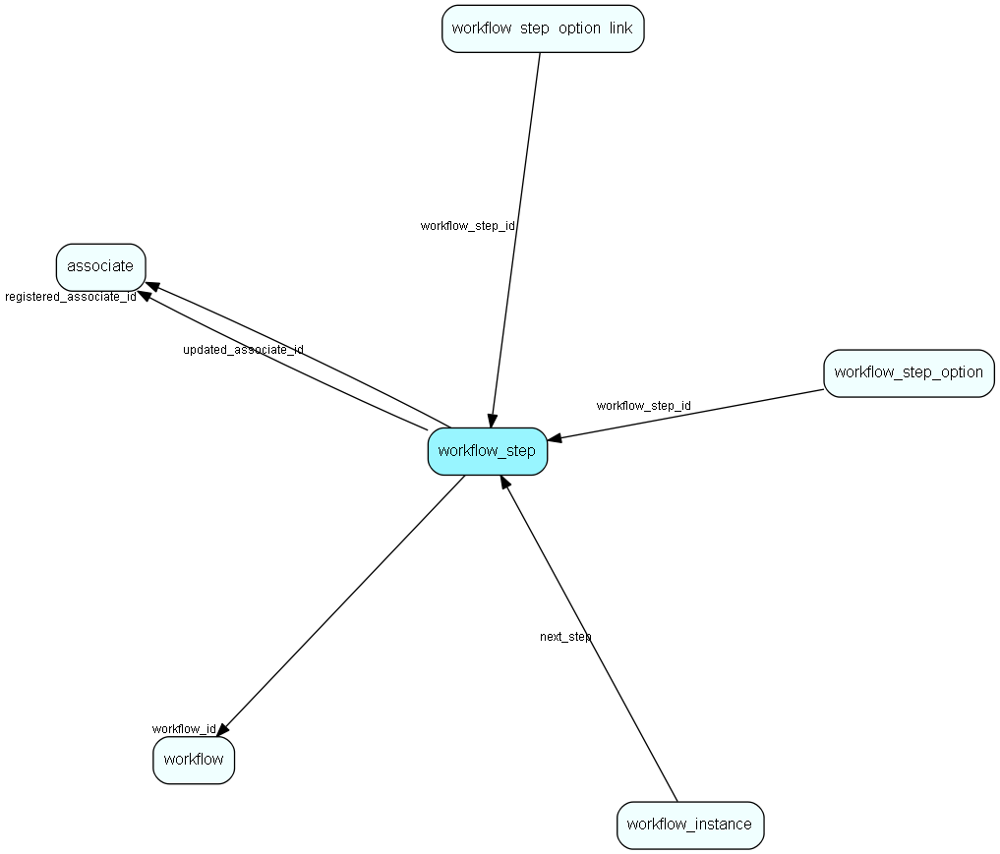

# workflow\_step Table (514)

A set of steps related to a workflow.

## Fields

| Name | Description | Type | Null |
|------|-------------|------|:----:|
|workflow\_step\_id|Primary key|PK| |
|step\_type|Step type|Enum [WorkflowStepType](enums/workflowsteptype.md)|&#x25CF;|
|settings|Step settings/configuration/variables|Clob|&#x25CF;|
|registered|Registered when|UtcDateTime| |
|registered\_associate\_id|Registered by whom|FK [associate](associate.md)| |
|updated|Last updated when|UtcDateTime| |
|updated\_associate\_id|Last updated by whom|FK [associate](associate.md)| |
|updatedCount|Number of updates made to this record|UShort| |

[!include[details](./includes/workflow-step.md)]

## Indexes

| Fields | Types | Description |
|--------|-------|-------------|
|workflow\_step\_id |PK |Clustered, Unique |

## Relationships

| Table|  Description |
|------|-------------|
|[associate](associate.md)  |Employees, resources and other users - except for External persons |
|[s\_shipment\_addr](s-shipment-addr.md)  |Addresses that are ready to be sent in a shipment. |
|[workflow\_instance](workflow-instance.md)  |A set of properties related to the workflow instance of one participant going through the flow |
|[workflow\_root\_step\_link](workflow-root-step-link.md)  |Link root steps to the workflow |
|[workflow\_step\_option](workflow-step-option.md)  |Some steps can have optional child &apos;flows&apos;, a new series of steps |
|[workflow\_step\_option\_link](workflow-step-option-link.md)  |Link steps to other steps through step options |
|[workflow\_wait\_for\_action](workflow-wait-for-action.md)  |Some steps wait for actions, this is info about those actions |

## Replication Flags

* None

## Security Flags

* Sentry controls access to items in this table using user's Role and data rights matrix on the table's parent.

