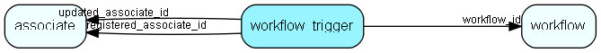

# workflow\_trigger Table (515)

A set of triggers related to a workflow.

## Fields

| Name | Description | Type | Null |
|------|-------------|------|:----:|
|workflow\_trigger\_id|Primary key|PK| |
|workflow\_id|The flow this trigger belongs to|FK [workflow](workflow.md)|&#x25CF;|
|trigger\_type|What kind of trigger is this|Enum [WorkflowTriggerType](enums/workflowtriggertype.md)|&#x25CF;|
|registered|Registered when|UtcDateTime| |
|registered\_associate\_id|Registered by whom|FK [associate](associate.md)| |
|updated|Last updated when|UtcDateTime| |
|updated\_associate\_id|Last updated by whom|FK [associate](associate.md)| |
|updatedCount|Number of updates made to this record|UShort| |

[!include[details](./includes/workflow-trigger.md)]

## Indexes

| Fields | Types | Description |
|--------|-------|-------------|
|workflow\_trigger\_id |PK |Clustered, Unique |

## Relationships

| Table|  Description |
|------|-------------|
|[associate](associate.md)  |Employees, resources and other users - except for External persons |
|[workflow](workflow.md)  |SuperOffice specific info about a workflow |

## Replication Flags

* None

## Security Flags

* Sentry controls access to items in this table using user's Role and data rights matrix on the table's parent.

