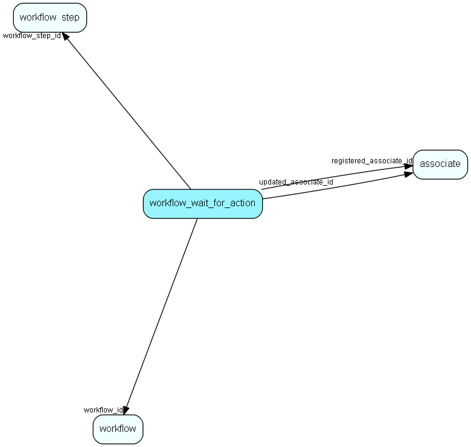

# workflow\_wait\_for\_action Table (520)

Some steps wait for actions, this is info about those actions

## Fields

| Name | Description | Type | Null |
|------|-------------|------|:----:|
|workflow\_wait\_for\_action\_id|Primary key|PK| |
|workflow\_step\_id|The workflow step this instance belongs to|FK [workflow_step](workflow-step.md)|&#x25CF;|
|ActionType|The type of action|Enum [WorkflowWaitForActionType](enums/workflowwaitforactiontype.md)|&#x25CF;|
|rank|The rank of this action|Int|&#x25CF;|
|registered|Registered when|UtcDateTime| |
|registered\_associate\_id|Registered by whom|FK [associate](associate.md)| |
|updated|Last updated when|UtcDateTime| |
|updated\_associate\_id|Last updated by whom|FK [associate](associate.md)| |
|updatedCount|Number of updates made to this record|UShort| |

[!include[details](./includes/workflow-wait-for-action.md)]

## Indexes

| Fields | Types | Description |
|--------|-------|-------------|
|workflow\_wait\_for\_action\_id |PK |Clustered, Unique |

## Relationships

| Table|  Description |
|------|-------------|
|[associate](associate.md)  |Employees, resources and other users - except for External persons |
|[workflow\_step](workflow-step.md)  |A set of steps related to a workflow. |

## Replication Flags

* None

## Security Flags

* Sentry controls access to items in this table using user's Role and data rights matrix on the table's parent.

