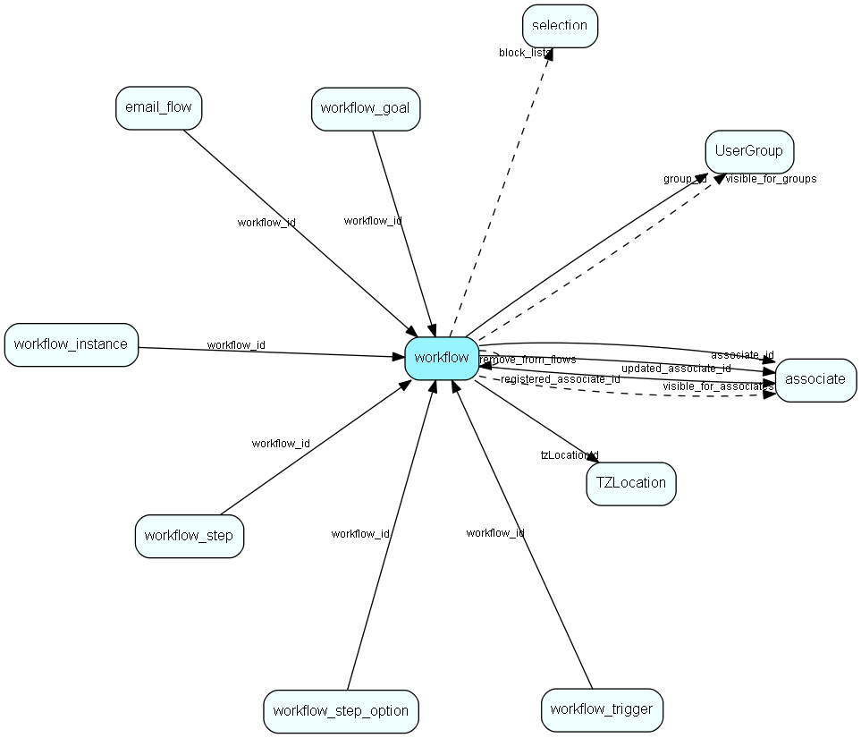

# workflow Table (510)

SuperOffice specific info about a workflow

## Fields

| Name | Description | Type | Null |
|------|-------------|------|:----:|
|workflow\_id|Primary key|PK| |
|name|Name of the workflow|String(255)|&#x25CF;|
|description|Description of the workflow|String(4000)|&#x25CF;|
|status|Status of the workflow definition|Enum [WorkflowDefinitionStatus](enums/workflowdefinitionstatus.md)|&#x25CF;|
|associate\_id|Associate who owns this workflow|FK [associate](associate.md)|&#x25CF;|
|group\_id|Group id of *original* owning associate, so that changes to owner&apos;s primary group do not influence group membership of this workflow.|FK [UserGroup](usergroup.md)|&#x25CF;|
|start\_only\_once|A contact can start this flow only once|Bool|&#x25CF;|
|jump\_to\_finish|When a goal is reached, contact jumps directly to finished|Bool|&#x25CF;|
|visible\_for\_all|True if visible for all|Bool|&#x25CF;|
|visible\_for\_associates|Array of references to the visible for associates|FKArray|&#x25CF;|
|visible\_for\_groups|Array of references to the visible for groups|FKArray|&#x25CF;|
|registered|Registered when|UtcDateTime| |
|registered\_associate\_id|Registered by whom|FK [associate](associate.md)| |
|updated|Last updated when|UtcDateTime| |
|updated\_associate\_id|Last updated by whom|FK [associate](associate.md)| |
|updatedCount|Number of updates made to this record|UShort| |
|use\_workflow\_start|Start the flow running with enrolled participants at the given time|Bool|&#x25CF;|
|workflow\_start|When to start running the workflow. Until start, any enrolled members are not running through the flow, just waiting. Datetime is interpreted in stored timezone or as UTC|UtcDateTime|&#x25CF;|
|use\_enrollment\_end|End enrollment into the workflow at the given time|Bool|&#x25CF;|
|enrollment\_end|Do not enroll more participant after given time, interpreted in stored timezone or as UTC|UtcDateTime|&#x25CF;|
|tzLocationId|Timezone used for this workflows datetimes. If not set, behavior is best guess - databasetime, system time...|FK [TZLocation](tzlocation.md)|&#x25CF;|
|remove\_from\_flows|Workflows to remove the participants from when they are enrolled in this workflow|FKArray|&#x25CF;|
|block\_lists|Persons in the given selections are not allowed to enter this workflow|FKArray|&#x25CF;|
|exit\_flow\_id|On exit with no success criteria met, we attempt to add the participant to the given flow|FK [workflow](workflow.md)|&#x25CF;|
|exit\_success\_flow\_id|On exit with success criteria met, we attempt to add the participant to the given flow|FK [workflow](workflow.md)|&#x25CF;|

[!include[details](./includes/workflow.md)]

## Indexes

| Fields | Types | Description |
|--------|-------|-------------|
|workflow\_id |PK |Clustered, Unique |
|associate\_id |FK |Index |
|visible\_for\_associates, visible\_for\_groups, remove\_from\_flows, block\_lists |FKArray, FKArray, FKArray, FKArray |Full text |

## Relationships

| Table|  Description |
|------|-------------|
|[appointment](appointment.md)  |Tasks, appointments, followups, phone calls; and documents (document_id != 0). An appointment always has a corresponding record in VisibleFor specifying who may see this.  |
|[associate](associate.md)  |Employees, resources and other users - except for External persons |
|[email\_flow](email-flow.md)  |A set of properties related to the email workflow. |
|[person](person.md)  |Persons in a company or an organizations. All associates have a corresponding person record |
|[sale](sale.md)  |Sales  For every Sale record edited through the SuperOffice GUI, a copy of the current version of the record will be saved in the SaleHist table. This also applies to editing done through the SaleModel COM interface, but not to editing done through the OLE DB Provider or other channels.   |
|[selection](selection.md)  |Selections |
|[ticket](ticket.md)  |This table contains the tickets (requests) of the system. Its purpose should be evident. |
|[TZLocation](tzlocation.md)  |Time zone location |
|[UserGroup](usergroup.md)  |Secondary user groups |
|[workflow](workflow.md)  |SuperOffice specific info about a workflow |
|[workflow\_goal](workflow-goal.md)  |A set of goals related to a workflow. Some goals will have search criterias associated with it to determine if the goal has been reached. |
|[workflow\_instance](workflow-instance.md)  |A set of properties related to the workflow instance of one participant going through the flow |
|[workflow\_root\_step\_link](workflow-root-step-link.md)  |Link root steps to the workflow |
|[workflow\_trigger](workflow-trigger.md)  |A set of triggers related to a workflow. |

## Replication Flags

* None

## Security Flags

* Sentry controls access to items in this table using user's Role and data rights matrix.

