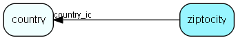

# ziptocity Table (16)

Zip codes and city names. Zip codes used during address entry. You will find more information about addressformat on http;//techdoc.superoffice.com 

## Fields

| Name | Description | Type | Null |
|------|-------------|------|:----:|
|ziptocity\_id|Primary key|PK| |
|country\_id|Country this zip table is valid for|FK [country](country.md)|&#x25CF;|
|zipcode|Zipcode|String(11)| |
|city|City field|String(79)| |
|updatedCount|Number of updates made to this record|UShort| |

[!include[details](./includes/ziptocity.md)]

## Indexes

| Fields | Types | Description |
|--------|-------|-------------|
|ziptocity\_id |PK |Clustered, Unique |
|city |String(79) |Index |
|country\_id, zipcode |FK, String(11) |Index |

## Relationships

| Table|  Description |
|------|-------------|
|[country](country.md)  |Country information |

## Replication Flags

* Replicate changes DOWN from central to satellites and travellers.
* Replicate changes UP from satellites and travellers back to central.
* Copy to satellite and travel prototypes.

## Security Flags

* No access control via user's Role.

