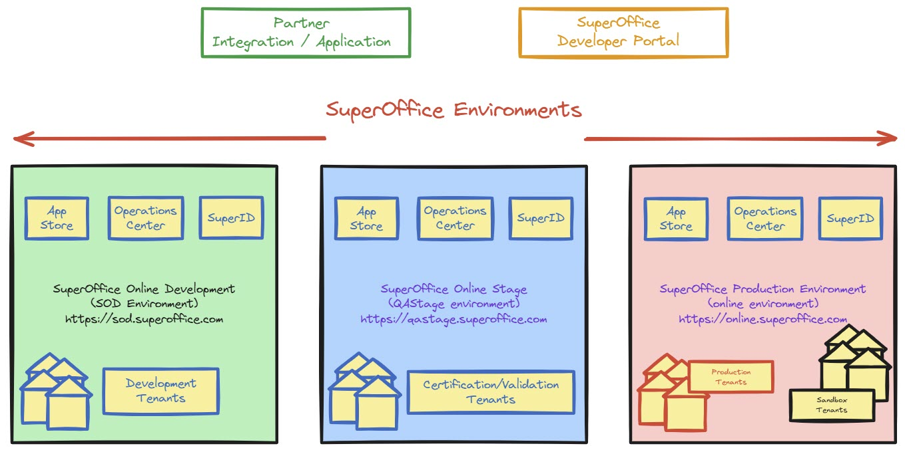

# Introduction to building SuperOffice applications

As an integration partner, you’re not just building an integration or application — you’re extending the capabilities of SuperOffice CRM Online. Your work enables custom integrations and complementary applications that enhance the value of our CRM. This page contains an overview of the entire onboarding journey, understand key concepts, and learn about the prerequisites necessary to get started with SuperOffice Online development.

## Registering for a developer account

To begin, you need to **sign up as a developer** on the **SuperOffice Developer Portal**.

### **Step-by-step instructions:**

1. **Navigate to the developer registration page**

   * Visit the [SuperOffice Developer Portal][2]
   * Click **Getting Started** or **Get your developer account** button

2. **Fill in the required information**

   * Provide your **full name**
   * Enter your **email address**
   * Enter your **company name** (or indicate if you are an independent developer)

3. **Provide relevant information (optional)**

   * Indicate whether you are **exploring APIs** or already have an application idea.
   * Specify if you have **prior experience** with SuperOffice development.

4. **Submit the registration form**

   * Click **Submit** to send your request.
   * You will receive an email confirming that your request has been received.

> [!WARNING]
> The approval process usually takes one business day. You will receive a confirmation email with your SOD tenant details once your request is processed.

## Understanding SuperOffice environments

There are three different environments: development, stage, and production. Each environment serves a distinct purpose. 

SuperOffice Online Development (SOD) is for research, experimentation, and early development. It does not and will never contain production data. It’s a safe space to test your app without impacting live data.

Stage ensures stability under load and compliance with security standards under conditions that mimic production.

Production is the environment that your customers use, and where your fully vetted application can access. Alternatively, you can order a [sandbox tenant][1] in the production environment, which is a ***copy*** of customer production data, for development and testing purposes. A production sandbox is a safe space to test your app without impacting live data.

## Receiving access to the SOD environment

Once your registration is approved, you will receive an **email confirmation** with the following details:

* Your **SuperOffice Online Development (SOD) tenant URL**
* Instructions on how to sign in

### **Understanding your SOD tenant**

* Your tenant in SOD is **separate from production environments**.
* You can **experiment freely** without affecting live customer data.
* The SOD tenant may be **shared** among multiple developers within your company.

## Understanding standard vs. custom applications

SuperOffice applications fall into two main categories:

### **Standard applications**

* These apps are **built for multiple customers**.
* They are **published in the SuperOffice App Store**.
* Customers can **install them directly** from the App Store.
* They must go through a **certification process** before deployment.

**Examples of standard apps:**

* ERP sync and quote integration
* Email marketing add-ons
* Document management systems

📌 **Reference:** [Building standard apps](apps-get-started.md)

### **Custom (one-off) applications**

* These apps are designed for **a single customer**.
* They are **not available in the App Store**.
* They must be manually installed for the **specific customer’s tenant**.
* They require **approval** before deployment.

**Examples of custom apps:**

* Internal business automation tools
* Company-specific data synchronization services

📌 **Reference:** [Application environments](app-envir.md)

---

## Available application templates

When registering a new application in the **SuperOffice developer portal**, you will choose from one of the following templates:

| **Application type** | **Use case** | **Best for** |
|---------------------|-------------|-------------|
| **Web app** | Interactive browser-based applications | Web-based integrations (OAuth 2.0) |
| **Native app** | Installed software with a local client | Desktop or mobile apps (PKCE flow) |
| **Server-to-server app** | Background services that don’t require user interaction | Automated processes, API integrations |
| **Mirroring app** | Database replication for offline access | Syncing SuperOffice data to an external database |
| **ERP sync & quote app** | Connecting SuperOffice to an ERP system | Integrating with ERP and quote services |
| **Empty app (DIY)** | A blank template for advanced users | Fully custom integrations |

Each template comes with **pre-configured API settings**, but you can **modify** them after creation.

📌 **Reference:** [Application registration](index.md)

---

## Choosing the right template

To determine the best template for your application, answer the following questions:

1️⃣ **Will your app require users to interact with it in a web browser?**

* If **yes**, choose a **web app** or **native app**.
* If **no**, consider a **server-to-server app** for automation.

2️⃣ **Will your app need access to SuperOffice without a logged-in user?**

* If **yes**, use **server-to-server app** (system-user authentication). Good for **web applications** that also need **back-channel** communications.

* If **no**, use **web app** (interactive login).

3️⃣ **Is your app syncing SuperOffice data to another system?**

* If **yes**, consider **ERP sync & quote** or **mirroring app**.

4️⃣ **Are you building a unique solution that doesn’t fit a template?**

* If **yes**, start with the **empty app (DIY)** template and configure it manually.

---

## Registering your application

Once you have selected the right application type, you are ready to **create your first app** in the **SuperOffice developer portal**.

### **Step-by-step instructions:**

1. **Go to the developer portal**

* Navigate to **[SuperOffice Developer Portal](https://dev.superoffice.com/)**
* Log in with your **developer credentials**

2. Click "Create app"**

* Go to your **partner page**
* In the **applications** section, click **create app**

3. **Choose a template**

* Select the template that **best fits your project**
* Click **next**

4. **Enter application details**

* Provide a **name** for your app
* Define one or more **redirect URLs** (if applicable)
* Set the **technical contact**

5. **Confirm and create the application**

* Click **create application**
* Your application is now registered in the **SOD environment**! 🎉

📌 **Reference:** [Registering a web app](web-app.md)
📌 **Reference:** [Registering a native app](native-app.md)

---

  <!-- Links -->

[1]: https://www.superoffice.com/order/sandbox/
[2]: https://dev.superoffice.com/
