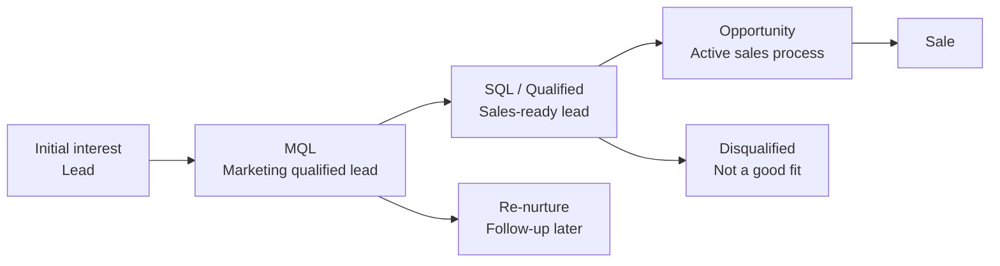

# Lead management

Lead management helps you understand where potential customers are in their buying journey and gives both marketing and sales a shared, structured way to track interest, readiness, and progress.

By using categories and lead statuses consistently, you can see which leads need attention now, which should be nurtured, and which are ready to move into the sales process.

Lead information is shown directly on the company and contact cards, in contact section tabs, in selections, and in dashboards, making it easy to prioritize the next step.

## Lead lifecycle

A lead typically moves through several stages before becoming a sales opportunity. SuperOffice uses a combination of **company category** and **contact lead status** to reflect each stage. These values help you understand whether a lead is new, being contacted, ready for sales follow-up, or not a good fit.

## Lead status

The **Lead status** field tracks a lead's progress from first contact to qualification. It helps sales and marketing teams prioritize activities and ensures a consistent view of each lead's position in the sales funnel.

Lead status is available only for contacts whose company belongs to a category in the **Potential customer** group with **Enable lead status** selected.

When this setting is active, the field appears directly below the **Category** field on the contact card. Each contact can have its own lead status, even if several people belong to the same company. For example, one person may be *Disqualified* while another is *Qualified* and ready to move forward in the sales process.

When a new contact is created for a company with lead status enabled, the field is automatically set to *Open*. If the company's category later changes to one that does not use lead status, the field disappears from view but the last recorded value is retained. This ensures that lead information remains searchable and available in dashboards, even when it is no longer editable in the UI.

> [!TIP]
> If you do not see the **Lead status** field on a contact, its category is not part of the *Potential customer* group.

### Predefined statuses

The following statuses are available by default in SuperOffice and represent key steps in how a lead can progress through the qualification process. [Lead statuses can be customized][2] by administrators.

| Status | Description |
|---|---|
| Open | No outreach has been made by the sales team yet. |
| Contacting | The sales team is actively trying to reach the lead. |
| Disqualified | The lead does not meet our criteria and will not be contacted further. |
| Re-nurture | The lead is not ready now but may be in the future. Marketing can follow up. |
| Qualified | The lead meets all necessary criteria to initiate the sales process. |

## Potential customer categories

The **Category** field on a company defines the type of relationship you have with that company, such as *Customer*, *Partner*, or *Lead*. Only categories that belong to the **Potential customer** group display the **Lead status** field.

Grouping categories by type ensures that leads are handled consistently:

* **Searches and dashboards** can easily filter on all potential customers at once.
* **Automations** can safely update categories without accidentally downgrading customers to leads.
* **Visibility:** the **Lead status** field appears automatically only where relevant.

### Predefined categories

The following categories represent key steps in how a lead can progress through the sales funnel. They are available by default in **new** SuperOffice databases version 11.6 and newer. Categories can be added and modified by administrators.

| Category | Description |
|---|---|
| Lead | A person or company that has shown initial interest but has not yet indicated intent to buy. |
| Marketing qualified lead (MQL) | A lead that matches your target profile or has requested further engagement, such as a demo. |
| Opportunity | A potential customer that is part of an active sales process. |
| Lost opportunity | A potential customer with one or several lost sales. |

## Where lead information appears

Lead information is shown in several places in SuperOffice CRM, making it easy to see a lead's progress and take action when needed.

* **Contact card:** The **Lead status** field appears directly below the **Category** field when the company uses a potential customer category with lead status enabled.

    ![Category and lead status shown on the Contact card. -screenshot][img2]

* **Company card:** The company's **Category** determines whether contacts under that company can show lead status.

* **Contact section tab:** You can add the **Lead status**, **Category**, and **Category group** columns to sort, filter, or group contacts based on their lead stage.

    ![Lead status shown for a contact in the company screen, with the company card on top and the contact section tab below. -screenshot][img1]

* **Search criteria:** Lead-related fields such as **Category**, **Category group**, and **Lead status** can be used to build dynamic selections for marketing or lead nurturing.

* **Board view of company/contact selections:** Visualize leads by status in a column-based layout.

* **Dashboards:** Dashboard tiles can show counts or lists of leads in specific statuses or categories, helping you monitor new, active, or disqualified leads.

## Related content

* [Work with leads in SuperOffice][4]
* [Conversion tracking][5]
* [Set up lead management][3] - in Settings and maintenance
* [Configure company categories][1]
* [Manage lead statuses][2]

<!-- Referenced links -->
[1]: ../admin/add-company-category.md
[2]: ../admin/add-lead-status.md
[3]: ../admin/index.md
[4]: work-with-leads.md
[5]: ../../marketing/utm/learn/index.md

<!-- Referenced images -->
[img1]: ../../../media/loc/en/lead/company-lead-with-contacts-section-tab.png
[img2]: ../../../media/loc/en/lead/contact-card-open-lead.png
