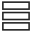

# Activities

![Activities in SuperOffice CRM -screenshot][img3]

## Types

There are two types of activities – documents and follow-ups. Follow-ups is a collective term for appointments, phone calls and tasks. In addition, mailings, form submissions and chat records are displayed in the **Activities** section tab.

* [Appointment][1]
* [Task][2]
* [Phone Call][3]
* [Work with documents][4]
* [Compose an email][5]
* [Chat][12]

The table below illustrates the different kinds of activities:

<!-- markdownlint-disable MD041 MD033 -->
<table>
<col />
<col />
<col />
<col />
<col />
<col />
<col />
<tr>
<td colspan="7" style="text-align: center;">Activities</td>
</tr>
<tr>
<td colspan="3" style="text-align: center;">Follow-ups</td>
<td colspan="2" style="text-align: center;">Documents</td>
<td rowspan="2" style="text-align: center;">Mailings / Form submissions</td>
<td rowspan="2" style="text-align: center;">Chat sessions</td>
</tr>
<tr>
<td>
Appointment</td>
<td>
Task</td>
<td>
Phone Call</td>
<td>
Document
</td>
<td>
Email</td>
<td rowspan="2" style="text-align: center;">Mailings / Form submissions</td>
<td rowspan="2" style="text-align: center;">Chat sessions</td>
</tr>
<tr>
</tr>
</table>
<!-- markdownlint-restore -->

## Where do I find activities?

| Location | Description | Read more |
|---|---|---|
| Company screen | Displays activities linked to the company in question. | [Activities (Company)][13] |
| Contact screen | Displays activities linked to the contact in question. | [Activities (Contact)][14] |
| Project screen | Displays activities linked to the project or sale in question. | [Activities (Project)][15] |
| Sale screen | Displays activities linked to the project or sale in question. | [Activities (Sale)][16] |
| Diary screen | Displays all your uncompleted activities. | [Activities (Diary)][6] |

> [!NOTE]
> Activities are also displayed in the [different views][7] in the **Diary** screen.

## Columns

The activities list columns contain the following information:

* ![icon][img1]: The first column in the activities list specifies the **Completed** status of an activity. A tick means that the activity is completed, while an empty box means that it is not completed.

* The Category column contains icons that indicate the type of activity, for example, a telephone for a call. These icons reflect the text in the **Type** column.

* The other columns in the activities list show various information about the activity. If not all the text in a field is visible, hold the mouse pointer over it to display it in a tooltip.

The activities displayed depend on which checkboxes you select at the bottom of the section tab:

* Follow-ups (appointments, tasks and phone calls)
* Documents (email, letters, and other documents)
* Mailings (bulk mailings by merged document, email or SMS)
* Other (chat records, form submissions)

You can show all activities, or just one type.

## Create activity

You create activities using the ![icon][img2] **New** menu in the top bar, or by clicking **Add** button in the section tab.

## Delete activity

You can delete activities from any screen where they are displayed:

1. Select one or more activities that you want to delete.

2. Right-click the selected activity or activities and select **Delete**.

    > [!NOTE]
    > On the **Activities** section tab, you can also select the activity and click the **Delete** button on the left, below the list.
    >
    > The **Delete** button is only available if the user who is logged in has permission to delete items from the activities list in question.

3. A confirmation dialog opens.

## What would you like to do now?

* [Filter activities][17]
* [Change Completed status of an activity][10]
* [Add follow-ups (appointments, tasks and phone calls)][8]
* [Dial contacts][11]
* [Work with documents][4]
* [Compose an email][5]

<!-- Referenced links -->
[1]: ../../diary/learn/appointment.md
[2]: ../../diary/learn/task.md
[3]: ../../diary/learn/phone-call/index.md
[4]: ../../document/learn/index.md
[5]: ../../email/learn/compose.md
[6]: ../../diary/learn/screen/activities-tab.md
[7]: ../../diary/learn/screen/index.md
[8]: ../../diary/learn/create-follow-up.md
[10]: ../../diary/learn/change-completed-status.md
[11]: ../../diary/learn/phone-call/dial.md
[12]: ../index.md
[13]: ../../company/learn/screen/activities-tab.md
[14]: ../../contact/learn/screen/activities-tab.md
[15]: ../../project/learn/screen/activities-project.md
[16]: ../../sale/learn/screen/activities-sale.md
[17]: ../getting-started/use-filters-in-section-tabs.md

<!-- Referenced images -->
[img1]: ../../../media/icons/check.bmp
[img2]: ../../../../common/icons/plus-black.png
[img3]: ../../diary/learn/media/activities-detail.bmp
