# Conversion tracking

Marketers often struggle to understand which campaigns, channels, or platforms generate the most valuable leads. Without this knowledge, it is difficult to optimize spend or prove return on investment (ROI).

Conversion tracking in SuperOffice helps you connect marketing activities to actual results. It uses **UTM parameters** to identify where each lead comes from and how visitors interact with your website before they become contacts or opportunities.

By tracking the source of each lead, you can:

* See exactly where each lead originated (for example, LinkedIn ad, newsletter, or Google search)
* Identify which channels and campaigns generate the most leads and deals
* Compare campaign performance and focus your marketing budget on what works

To understand how UTM tracking works in detail, see [UTM parameters explained][1].

## Data points tracked in SuperOffice CRM

SuperOffice captures several key data points to help you understand how leads are created and converted.

| Data point | Description | Storage level |
|---|---|---|
| **First touch** | The very first source, medium, and campaign that made the person interact with the company. | Contact |
| **Lead creation** | The source, medium, and campaign that led to the actual lead being created in the CRM. | Contact |
| **Conversion** | The most recent source, medium, and campaign that led an existing contact to submit a new form. | Form submission |
| **Company source** | When a new contact is added and a company card is created at the same time, the source is saved on the company card. | Company card |

> [!NOTE]
> First touch source, lead creation source, and company source are tracked only for new contact persons and companies that do not already exist in the CRM.

## How lead source is captured

A visitor clicks a **LinkedIn ad** and lands on your website. When they arrive, their *first touch data*—including the source, medium, and campaign—is stored in their browser. The visitor leaves the site without taking any further action.

Later, the same visitor clicks a **Facebook ad** and returns to your website. This time, they fill out and **submit a form**. When the form is submitted, SuperOffice captures the source data from the URL.

If the submission creates a new contact or lead in SuperOffice CRM, both the **first touch** and **lead creation** data are saved on the contact card.

```mermaid
flowchart TD
    subgraph Journey["Visitor journey"]
        A["<br/>&#8203;Clicks LinkedIn ad<br/> "] --> B["<br/>&#8203;Visits website<br/> "]
        B --> C["<br/>&#8203;Leaves site<br/> "]
        C --> D["<br/>&#8203;First touch data stored in browser<br/> "]
        D --> E["<br/>&#8203;Clicks Facebook ad<br/> "]
        E --> F["<br/>&#8203;Visits website again<br/> "]
        F --> G["<br/>&#8203;Submits form<br/> "]
    end

    subgraph CRM["CRM processing"]
        G --> H["<br/>&#8203;Source captured<br/> "]
        H --> I["<br/>&#8203;Both first touch and lead creation data stored in SuperOffice<br/> "]
    end

    style Journey fill:#f5faff,stroke:#c0d9f1,stroke-width:1px
    style CRM fill:#f2fff8,stroke:#a8e0c0,stroke-width:1px
```


<!--Alt text: Flow showing how first touch and lead creation data are stored in SuperOffice CRM after a form submission.-->

## View captured UTM data in SuperOffice CRM

When SuperOffice captures UTM parameters from a form submission, the **first touch** and **lead creation** details are visible in the contact’s **Privacy** tab under the *E-marketing* purpose.

You can view these read-only values by clicking *Show more*.

![The E-marketing section in the Privacy tab showing first touch and lead creation UTM fields -screenshot][img1]

You can also view UTM data, such as **Lead creation source** and **First touch campaign**, in the [**Contacts** section tab][7] on a company card.

Click <i class="ph ph-gear" aria-label="Gear icon"></i> to customize which columns are displayed.

![Contact section tab showing lead columns with UTM data -screenshot][img3]

## Use UTM data as search criteria

You can use UTM data fields to find or segment contacts and companies in SuperOffice CRM.

In the **Find** screen, add criteria under **Company** > **Lead** or **Contact** > **Lead**, for example:

* First touch source
* First touch campaign
* Lead creation source
* Lead creation medium
* Lead creation campaign

![The Find screen showing UTM fields available as criteria -screenshot][img2]

You can save your search results as a **selection**, which can later be used for targeted marketing activities or reports.

When you have a dynamic selection of companies or contacts, you can also open it in [Board view][6] to visualize lead progression.

## Real-world examples

### Use case 1: Identify which channel drives the most sign-ups

You run a **webinar** and promote it through a **LinkedIn post**, a **Google ad**, and an **email newsletter**.

After the event, you want to know:

* Which channel brought the most sign-ups?
* Which leads later became sales opportunities?

**Reports in SuperOffice show:**

* 50% of sign-ups came from LinkedIn.
* Leads from the email newsletter have a 30% higher conversion rate.

These insights help you adjust your budget and messaging for future campaigns.

### Use case 2: Compare performance across partner activities

You run three marketing activities with different partners:

* A partner newsletter
* A co-branded webinar
* A referral link on a partner's website

You want to know which activity generates the most new leads and deals.

| Source | Medium | Leads | Deals |
|---|---|---|---|
| Partner A | Email | 30 | 2 |
| Partner B | Webinar | 50 | 10 |
| Partner C | Referral | 10 | 1 |

Conversion tracking in SuperOffice helps you compare partner performance and focus on what drives measurable results.

## Example tracking URL

You can append UTM parameters to any campaign link to identify traffic sources.

```text
https://yourcompany.com/signup?utm_source=linkedin&utm_medium=social&utm_campaign=webinar_sept
```

Use the UTM builder for SuperOffice forms to create campaign links with consistent naming conventions.

## Related content

* [UTM parameters explained][1]
* [Enable UTM tracking for form submissions][3] in Settings and maintenance
* [UTM builder for SuperOffice form page​][2]
* [Lead dashboards and reports][5]
* [Lead management][8]

<!-- Referenced links -->
[1]: parameters.md
[2]: ../../forms/learn/publish.md
[3]: ../admin/set-up.md
[5]: ../../../dashboard/learn/show-leads.md
[6]: ../../../search-options/selection/learn/board-view.md
[7]: ../../../learn/section-tabs/contacts-tab.md
[8]: ../../../lead/learn/index.md

<!-- Referenced images -->
[img1]: ../../../../media/loc/en/marketing/contact-privacy-utm-data.png
[img2]: ../../../../media/loc/en/search-options/lead-utm-criteria.png
[img3]: ../../../../media/loc/en/marketing/lead-in-contact-section-tab.png
