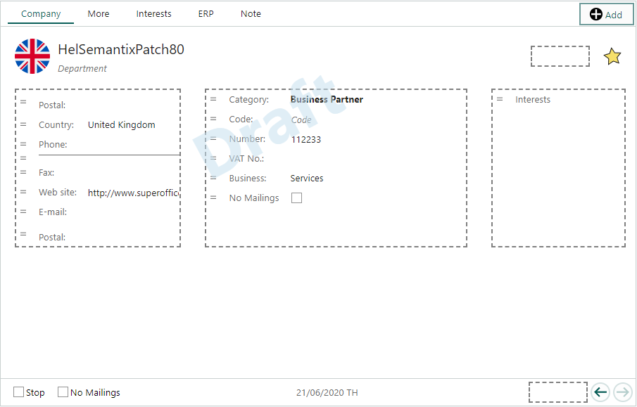

# Edit layout - Main cards

When you have [created a new layout][4], it is time to customize it according to the needs of the assigned user group(s). If you are customizing a layout for the sales team, you should have a clear plan of what their needs are with regards to the layout and formatting of the tabs, fields, elements and columns on the main card. Which information should be first and easiest to find? Do they need all fields and tabs? What is the logical order of the fields?

Personalize the layout for the main cards and archives to match your organization's information needs. When you edit the layout on a main card, you can add and remove fields, or rearrange the order to fit your team's needs. First, you need to know what information is most important for the team.

Watch this video and find out how to use the screen designer to configure your screens in SuperOffice CRM or follow the step-by-step guide below (video length - 6:41):

<!-- markdownlint-disable-next-line MD034 DOCSMD007 -->
> [!Video https://youtu.be/EcL4TEXXvmU]

## Steps

[!include[Go to screen designer](includes/goto-screen-designer.md)]

1. Click **Main cards**.

1. Select a layout in the list on the left side.

1. Click **Edit layout** below the preview.

1. In the **Edit card layout** window, edit the layout as described below.

1. After finishing, click one of the following buttons:

    * **Save draft**: Click this button if the layout is not finished yet.
    * **Save + Publish**: Click this button to publish the layout to the selected user groups.
    * **Cancel**: Click this button to discard all changes. See also [Undo changes](#undo-changes).

## Edit existing fields in the layout

1. Select the tab you want to edit.

2. Edit existing fields:

    * Move fields by clicking ![icon][img4] to the left of a field label and dragging the field to a new position. To add a new field, see [Fields](#fields).

    * Delete fields by holding the mouse-pointer over a field and clicking ![icon][img2]. Deleted fields can be re-added from the **Fields** section. Mandatory fields cannot be deleted, and the **Delete** button will not appear for such fields. See [Fields](#fields).

    * Edit field formatting (such as font format) and other settings by clicking the field. The **Settings** section opens in the left part of the window. See [Settings](#settings).

    ![Remove, add and move the different fields in the layout -screenshot][img3]

3. [Change the number of columns in a tab](#columns) from the **Columns** section.

4. Save the changes as described above.

## Add new content to a layout

1. Select the tab you want to edit, or click ![icon][img5] **Add** to add a new tab. See [Tabs](#tabs).

2. Edit the layout by selecting one of the following sections:

    * **Fields**: Drag [fields](#fields) from the list to the layout. Fields can be placed in the columns and in the header and footer.

    Boxes with stapled lines in the layout, indicate where you can place a field.
    

What does this look like?

    
    

    * **Elements**: Drag various elements such as labels, dividers, links and buttons to the layout.

    * **Settings**: Click a field or element in the layout to edit the relevant settings. The available settings may vary according to the selected object. See [Settings](#settings).

    * **Columns**: [Select how many columns you want to display in a tab](#columns).

3. After customizing the screen layout, click one of the following buttons:

    * **Save draft**: Click this button if the layout is not finished yet.
    * **Save + Publish**: Click this button to publish the layout to the selected user groups.
    * **Cancel**: Click this button to discard all changes.

Below you can find more detailed descriptions of the various sections and functions.

## Fields

In the **Fields** section you can find all available data fields for the selected screen layout. Use the filter function to find specific fields.

* Drag a field from the list to a stapled area in the selected tab.
* To make sure a field is always visible, no matter which tab is selected, place the field in the header or footer.
* You can place the same field in multiple locations in the screen layout, if relevant.
* Move fields by clicking ![icon][img4] to the left of a field label and dragging the field to a new position. To move a field to another tab, drag the field to the tab header to open the tab, and then place the field in the open tab.
* Delete fields by holding the mouse-pointer over a field and clicking ![icon][img2]. Mandatory fields cannot be deleted, and the **Delete** button will not appear for such fields.

**Limitations:**

* Mandatory fields cannot be deleted. This is defined in [Fields][3] screen.
* Some tabs, such as **ERP** and **Note**, cannot be edited, since they have specific functions.

## Elements

In the **Elements** section you can add various non-data elements such as labels, dividers, links and buttons.

## Settings

Make fields more visible by changing the font to bold and large text. Make room for more fields by using a smaller font. Save screen space by hiding labels.

Click a field or element in the layout to edit its settings. The available setting will vary according to the type of field or element.

## Columns

By default a tab has 2 columns, but you can use anything from 1-4 columns depending on you needs. Users with wide screens may prefer more columns, to view and sort more data.

**Limitations:**

* Changing from 2-4 columns to 1 column will move all fields into 1 column.
* Using 4 columns may affect visibility of some fields. You may consider to hide the labels of some fields (see [Settings](#settings)).
* Some tabs, such as **ERP** and **Note**, do not have a column setup, since they have specific functions.
* If a user does not have the screen size to fit all columns, they are stacked on top of each other.

## Tabs

Add more tabs for additional fields, or remove irrelevant tabs.

**To remove a tab:**

1. Select the tab and click **Task** > **Remove tab**.
2. Click **OK** in the dialog that is displayed.

**To add a new tab:**

1. Click ![icon][img5] **Add**. The **Columns** section opens to the left.
2. Under **Tab title**, replace the text **New tab** with the new tab name.
3. You can also add the tab name in other languages by clicking ![icon][img1] (see [Translation][2]).
4. Select the number of columns you want to use in the new tab.

> [!TIP]
> If you later want to rename the tab, select the tab and select **Columns**.

**Limitations:**

* You cannot rename any of the default tabs.
* You cannot remove a tab that contains mandatory fields. Mandatory fields must be moved to another tab first.
* If only one tab remains, you cannot delete it.

## Undo changes

If you need to revert to an earlier version of the screen, you can access the following options from the **Task** button:

* **Reset to factory settings**: This option discards all changes and resets the screen layout to the standard layout delivered by SuperOffice.
* **Discard draft**: Discards all changes and resets to the published version of the screen layout.

<!-- Referenced links -->
[2]: ../../../globalization-and-localization/learn/translate-fields.md
[3]: ../../../custom-objects/learn/udef/index.md
[4]: add-new-layout.md

<!-- Referenced images -->
[img1]: ../../../../../common/icons/az.png
[img2]: ../../../../../common/icons/delete-circle-red.png
[img4]: ../../../../media/icons/criteria-move.png
[img5]: ../../../../../common/icons/add-icon.png
[img3]: media/edit-the-screen-layout-of-companies-and-contacts.png
