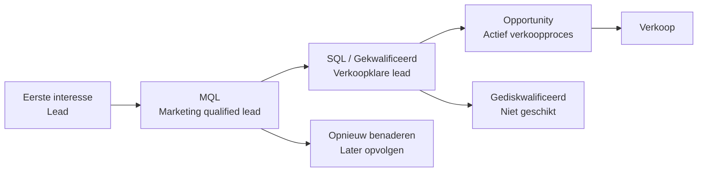

# Leadbeheer

Leadbeheer helpt u te begrijpen waar potentiële klanten zich bevinden in hun kooptraject en biedt zowel marketing als sales een gestructureerde manier om interesse, gereedheid en voortgang te volgen.

Door categorieën en leadstatus consequent te gebruiken, ziet u welke leads aandacht nodig hebben, welke moeten worden nurtured en welke klaar zijn voor de salesfase.

Leadinformatie wordt direct weergegeven op bedrijfs- en persoonskaarten, in het tabblad Contactpersonen, in selecties en in dashboards, waardoor u gemakkelijk de volgende stap kunt prioriteren.

## Leadlevenscyclus

Een lead doorloopt doorgaans meerdere fasen voordat deze een verkoopkans wordt. SuperOffice gebruikt een combinatie van **bedrijfscategorie** en **leadstatus van de persoon** om elke fase weer te geven. Deze waarden helpen u te begrijpen of een lead nieuw is, wordt benaderd, klaar is voor sales follow-up of niet geschikt is.

## Leadstatus

Het veld **Leadstatus** volgt de voortgang van een lead van eerste contact tot kwalificatie. Het helpt sales- en marketingteams activiteiten te prioriteren en zorgt voor een consistent beeld van de positie van elke lead in de verkooptrechter.

Leadstatus is alleen beschikbaar voor personen wiens bedrijf behoort tot een categorie in de groep **Potentiële klant** met **Leadstatus inschakelen** geselecteerd.

Wanneer deze instelling actief is, verschijnt het veld direct onder het veld **Categorie** op de persoonskaart. Elke persoon kan een eigen leadstatus hebben, zelfs als meerdere personen tot hetzelfde bedrijf behoren. Zo kan bijvoorbeeld de ene persoon *Gediskwalificeerd* zijn terwijl een ander *Gekwalificeerd* is en klaar om verder te gaan in het verkoopproces.

Wanneer een nieuwe persoon wordt aangemaakt voor een bedrijf met leadstatus ingeschakeld, wordt het veld automatisch ingesteld op *Open*. Als de categorie van het bedrijf later verandert naar een categorie die geen leadstatus gebruikt, verdwijnt het veld uit beeld, maar blijft de laatst geregistreerde waarde behouden. Dit zorgt ervoor dat leadinformatie doorzoekbaar blijft en beschikbaar is in dashboards, zelfs wanneer deze niet langer bewerkbaar is in de gebruikersinterface.

> [!TIP]
> Als u het veld **Leadstatus** niet ziet op een persoon, maakt de categorie daarvan geen deel uit van de groep *Potentiële klant*.

### Standaardstatussen

De volgende statussen zijn standaard beschikbaar in SuperOffice en vertegenwoordigen belangrijke stappen in hoe een lead door het kwalificatieproces kan gaan. [Leadstatussen kunnen worden aangepast][2] door beheerders.

| Status | Beschrijving |
|---|---|
| Open | Er is nog geen contact geweest. |
| Contact opnemen | Sales probeert de lead te bereiken. |
| Gediskwalificeerd | De lead voldoet niet aan de criteria. |
| Opnieuw benaderen | Mogelijk later relevant. |
| Gekwalificeerd | Klaar voor de salesfase. |

## Categorieën voor potentiële klanten

Het veld **Categorie** op een bedrijf definieert het type relatie dat u met dat bedrijf hebt, zoals *Klant*, *Partner* of *Lead*. Alleen categorieën die tot de groep **Potentiële klant** behoren, tonen het veld **Leadstatus**.

Het groeperen van categorieën per type zorgt ervoor dat leads consistent worden behandeld:

* **Zoekopdrachten en dashboards** kunnen gemakkelijk alle potentiële klanten tegelijk filteren.
* **Automatiseringen** kunnen categorieën veilig bijwerken zonder per ongeluk klanten te downgraden naar leads.
* **Zichtbaarheid:** het veld **Leadstatus** verschijnt automatisch alleen waar relevant.

### Standaardcategorieën

De volgende categorieën vertegenwoordigen belangrijke stappen in hoe een lead door de verkooptrechter kan gaan. Ze zijn standaard beschikbaar in **nieuwe** SuperOffice-databases versie 11.6 en nieuwer. Categorieën kunnen worden toegevoegd en gewijzigd door beheerders.

| Categorie | Beschrijving |
|---|---|
| Lead | Initieel interesse getoond. |
| Marketinggekwalificeerde lead (MQL) | Past binnen de doelgroep of vraagt opvolging. |
| Opportunity | Actief in een salesproces. |
| Verloren opportunity | Saleskans(sen) verloren. |

## Waar leadinformatie verschijnt

Leadinformatie wordt op verschillende plaatsen in SuperOffice CRM weergegeven, waardoor u gemakkelijk de voortgang van een lead kunt zien en actie kunt ondernemen wanneer dat nodig is.

* **Persoonskaart:** Het veld **Leadstatus** verschijnt direct onder **Categorie** wanneer het bedrijf een categorie voor potentiële klanten met leadstatus ingeschakeld gebruikt.

    ![Categorie en leadstatus op de persoonskaart. -screenshot][img2]

* **Bedrijfskaart:** De **Categorie** van het bedrijf bepaalt of personen onder dat bedrijf leadstatus kunnen tonen.

* **Tabblad Contactpersonen:** U kunt de kolommen **Leadstatus**, **Categorie** en **Categoriegroep** toevoegen om personen te sorteren, filteren of groeperen op basis van hun leadfase.

    ![Leadstatus weergegeven in het bedrijfs­scherm met contactsectie. -screenshot][img1]

* **Zoekcriteria:** Leadgerelateerde velden zoals **Categorie**, **Categoriegroep** en **Leadstatus** kunnen worden gebruikt om dynamische selecties te maken voor marketing of lead nurturing.

* **Bordweergave:** Visualiseer leads op status in een kolomindeling.

* **Dashboards:** Dashboardtegels kunnen aantallen of lijsten van leads in specifieke statussen of categorieën weergeven, zodat u nieuwe, actieve of gediskwalificeerde leads kunt volgen.

## Gerelateerde inhoud

* [Werken met leads in SuperOffice][4]
* [Conversietracking][5]
* [Leadbeheer instellen][3] - in Instellingen en onderhoud
* [Bedrijfscategorieën configureren][1]
* [Leadstatussen beheren][2]

<!-- Referenced links -->
[1]: ../admin/add-company-category.md
[2]: ../admin/add-lead-status.md
[3]: ../admin/index.md
[4]: work-with-leads.md
[5]: ../../marketing/utm/learn/index.md

<!-- Referenced images -->
[img1]: ../../../media/loc/en/lead/company-lead-with-contacts-section-tab.png
[img2]: ../../../media/loc/en/lead/contact-card-open-lead.png
