# Conversietracking

Marketeers hebben vaak moeite te begrijpen welke campagnes, kanalen of platforms de meest waardevolle leads genereren. Zonder deze kennis is het lastig om uitgaven te optimaliseren of de return on investment (ROI) aan te tonen.

Conversietracking in SuperOffice helpt je om marketingactiviteiten te koppelen aan echte resultaten. Het gebruikt **UTM-parameters** om te bepalen waar elke lead vandaan komt en hoe bezoekers met je website omgaan voordat ze contactpersoon of verkoopkans worden.

Door de bron van elke lead te volgen, kun je:

* Precies zien waar elke lead vandaan kwam (bijv. LinkedIn-advertentie, nieuwsbrief of Google-zoekopdracht)
* Identificeren welke kanalen en campagnes de meeste leads en deals opleveren
* Campagneprestaties vergelijken en je marketingbudget richten op wat werkt

Voor meer informatie over hoe UTM-tracking werkt, zie [UTM-parameters uitgelegd][1].

## Gegevenspunten die in SuperOffice CRM worden gevolgd

SuperOffice legt meerdere belangrijke gegevenspunten vast om inzicht te geven in hoe leads worden aangemaakt en geconverteerd.

| Gegevenspunt | Beschrijving | Opslagniveau |
|---|---|---|
| **Eerste contact (First touch)** | De eerste bron, het medium en de campagne die ervoor zorgden dat de persoon met het bedrijf in contact kwam. | Persoon |
| **Lead-creatie** | De bron, het medium en de campagne die leidden tot het daadwerkelijke aanmaken van de lead in het CRM. | Persoon |
| **Conversie** | De meest recente bron, het medium en de campagne die een bestaande contactpersoon ertoe brachten een nieuw formulier in te dienen. | Formulierverzending |
| **Bedrijfsbron** | Wanneer een nieuwe contactpersoon wordt toegevoegd en tegelijkertijd een bedrijfskaart wordt aangemaakt, wordt de bron op de bedrijfskaart opgeslagen. | Bedrijf |

> [!NOTE]
> Eerste contact, lead-creatie en bedrijfsbron worden alleen gevolgd voor nieuwe contactpersonen en bedrijven die nog niet in het CRM bestaan.

## Hoe de leadbron wordt vastgelegd

Een bezoeker klikt op een **LinkedIn-advertentie** en komt op je website terecht. Bij aankomst worden *eerste contactgegevens* – inclusief bron, medium en campagne – opgeslagen in de browser. De bezoeker verlaat de site zonder verdere actie.

Later klikt dezelfde persoon op een **Facebook-advertentie** en keert terug naar de site. Deze keer vult de bezoeker een formulier in en **zendt dit in**. Wanneer het formulier wordt ingediend, legt SuperOffice de brongegevens uit de URL vast.

Als de inzending een nieuwe contactpersoon of lead in SuperOffice CRM aanmaakt, worden zowel **eerste contact** als **lead-creatie** opgeslagen op de contactkaart.

```mermaid
flowchart TD
    subgraph Journey["Bezoekersreis"]
        A["<br/>&#8203;Klikt op LinkedIn-advertentie<br/> "] --> B["<br/>&#8203;Bezoekt website<br/> "]
        B --> C["<br/>&#8203;Verlaat website<br/> "]
        C --> D["<br/>&#8203;Eerste contactgegevens opgeslagen in browser<br/> "]
        D --> E["<br/>&#8203;Klikt op Facebook-advertentie<br/> "]
        E --> F["<br/>&#8203;Bezoekt website opnieuw<br/> "]
        F --> G["<br/>&#8203;Verstuurt formulier<br/> "]
    end

    subgraph CRM["CRM-verwerking"]
        G --> H["<br/>&#8203;Bron vastgelegd<br/> "]
        H --> I["<br/>&#8203;Zowel eerste contact als lead-creatie opgeslagen in SuperOffice<br/> "]
    end

    style Journey fill:#f5faff,stroke:#c0d9f1,stroke-width:1px
    style CRM fill:#f2fff8,stroke:#a8e0c0,stroke-width:1px
```


<!--Alt-tekst: Diagram dat laat zien hoe eerste contact en lead-creatie in SuperOffice CRM worden opgeslagen na een formulierverzending.-->

## Vastgelegde UTM-gegevens weergeven in SuperOffice CRM

Wanneer SuperOffice UTM-parameters uit een formulierverzending vastlegt, zijn de gegevens over **eerste contact** en **lead-creatie** zichtbaar in het **Privacy**-tabblad van de contactpersoon onder het doel *E-marketing*.
Je kunt deze alleen-lezen waarden weergeven door op *Meer weergeven* te klikken.

![De E-marketingsectie in het Privacy-tabblad toont eerste contact en lead-creatie UTM-velden -screenshot][img1]

Je kunt UTM-gegevens ook bekijken in het [sectietabblad **Personen**][7] op een bedrijfskaart.

Klik op <i class="ph ph-gear" aria-label="Gear icon"></i> om aan te passen welke kolommen worden weergegeven.

![Sectietabblad Personen toont lead-kolommen met UTM-gegevens -screenshot][img3]

## Gebruik UTM-gegevens als zoekcriteria

Je kunt UTM-gegevensvelden gebruiken om contactpersonen en bedrijven te vinden of te segmenteren in SuperOffice CRM.

Voeg in het **Zoeken**-scherm criteria toe onder **Bedrijf** > **Lead** of **Contactpersoon** > **Lead**, bijvoorbeeld:

* Eerste contactbron
* Eerste contactcampagne
* Lead-creatiebron
* Lead-creatiemedium
* Lead-creatiecampagne

![Het Zoeken-scherm toont UTM-velden beschikbaar als criteria -screenshot][img2]

Je kunt je zoekresultaten opslaan als een **selectie**, die later kan worden gebruikt voor gerichte marketingactiviteiten of rapporten.

Wanneer je een dynamische selectie van bedrijven of contactpersonen hebt, kun je deze ook openen in [Bordweergave][6] om lead-voortgang te visualiseren.

## Praktijkvoorbeelden

### Gebruikssituatie 1: Achterhalen welk kanaal de meeste aanmeldingen oplevert

Je organiseert een **webinar** en promoot dit via een **LinkedIn-bericht**, een **Google-advertentie** en een **nieuwsbrief**.

Na het evenement wil je weten:

* Welk kanaal leverde de meeste aanmeldingen op?
* Welke leads werden later verkoopkansen?

**Rapporten in SuperOffice tonen:**

* 50 % van de aanmeldingen kwam via LinkedIn.
* Leads uit de nieuwsbrief hebben een 30 % hogere conversieratio.

Deze inzichten helpen je budget en boodschap voor toekomstige campagnes te optimaliseren.

### Gebruikssituatie 2: Vergelijk prestaties tussen partneractiviteiten

Je voert drie marketingactiviteiten uit met verschillende partners:

* Een partnernieuwsbrief
* Een gezamenlijk webinar
* Een verwijzingskoppeling op de website van de partner

Je wilt weten welke activiteit de meeste nieuwe leads en deals oplevert.

| Bron | Medium | Leads | Deals |
|---|---|---|---|
| Partner A | E-mail | 30 | 2 |
| Partner B | Webinar | 50 | 10 |
| Partner C | Verwijzing | 10 | 1 |

Conversietracking in SuperOffice helpt je partnerprestaties te vergelijken en te focussen op wat meetbare resultaten oplevert.

## Voorbeeld van trackingkoppeling

Je kunt UTM-parameters toevoegen aan elke campagnekoppeling om verkeersbronnen te identificeren.

```text
https://yourcompany.com/signup?utm_source=linkedin&utm_medium=social&utm_campaign=webinar_sept
```

Gebruik de UTM-builder voor SuperOffice-formulieren om campagnekoppelingen te maken met consistente naamgeving.

## Gerelateerde inhoud

* [UTM-parameters uitgelegd][1]
* [UTM-tracking inschakelen voor formulierverzendingen][3] in Instellingen en onderhoud
* [UTM-builder voor SuperOffice-formulieren][2]
* [Lead-dashboards en rapporten][5]
* [Leadbeheer][8]

[1]: parameters.md
[2]: ../../forms/learn/publish.md
[3]: ../admin/set-up.md
[5]: ../../../dashboard/learn/show-leads.md
[6]: ../../../search-options/selection/learn/board-view.md
[7]: ../../../learn/section-tabs/contacts-tab.md
[8]: ../../../lead/learn/index.md

<!-- Referenced images -->
[img1]: ../../../../media/loc/en/marketing/contact-privacy-utm-data.png
[img2]: ../../../../media/loc/en/search-options/lead-utm-criteria.png
[img3]: ../../../../media/loc/en/marketing/lead-in-contact-section-tab.png
