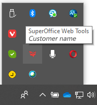

<!-- markdownlint-disable-file MD041 -->
SharePoint: Opprett et nytt dokument. Hvis det åpnes i Microsoft Office Online, bruker du SharePoint.

SuperOffice WebTools: Åpne systemstatusfeltet nederst til høyre på skrivebordet og se etter SuperOffice-ikonet.

