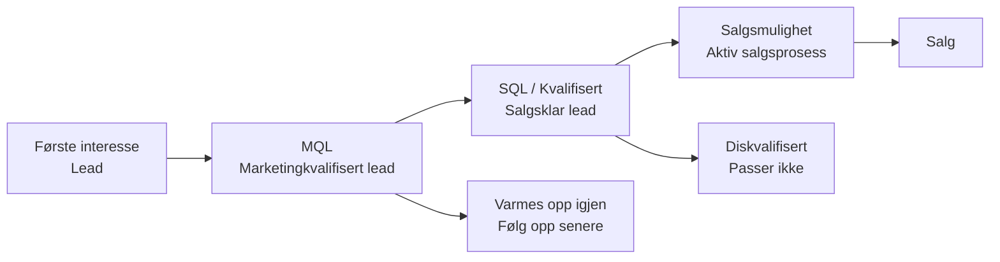

# Leadhåndtering

Leadhåndtering hjelper deg å forstå hvor potensielle kunder befinner seg i kjøpsreisen og gir både markedsføring og salg en felles, strukturert måte å spore interesse, beredskap og fremdrift på.

Ved å bruke kategorier og leadstatuser konsekvent kan du se hvilke leads som trenger oppfølging nå, hvilke som bør varmes opp over tid, og hvilke som er klare til å gå videre i salgsprosessen.

Leadinformasjon vises direkte på firma- og personkort, i personfaner, i utvalg og i dashbord, slik at du enkelt kan prioritere neste steg.

## Leadlivssyklus

En lead beveger seg vanligvis gjennom flere stadier før den blir en salgs­mulighet. SuperOffice bruker en kombinasjon av **firmakategori** og **personens leadstatus** for å gjenspeile hvert trinn. Disse verdiene hjälper deg å forstå om en lead er ny, blir kontaktet, er klar for salgsoppfølging eller ikke passer.

## Leadstatus

Feltet **Leadstatus** sporer en leads fremdrift fra første kontakt til kvalifisering. Det hjelper salg og markedsføring med å prioritere aktiviteter og gir et konsekvent bilde av hvor leadden befinner seg i salgstrakten.

Leadstatus er tilgjengelig kun for personer hvis firma tilhører gruppen **Potensiell kunde** og **Aktiver leadstatus** er valgt.

Når dette er aktivert, vises feltet rett under **Kategori** på personkortet. Hver person kan ha sin egen leadstatus, selv om flere personer tilhører samme firma.

Når en ny person opprettes under et firma som bruker leadstatus, settes feltet automatisk til *Åpen*. Endres firmakategorien til en som ikke bruker leadstatus, skjules feltet, men verdien beholdes for søk og dashbord.

> [!TIP]
> Ser du ikke **Leadstatus**, bruker firmaet ikke en kategori i gruppen *Potensiell kunde*.

### Forhåndsdefinerte statuser

Følgende statuser er tilgjengelige som standard i SuperOffice og representerer viktige steg i hvordan en lead kan utvikle seg gjennom kvalifiseringsprosessen. [Leadstatuser kan tilpasses][2] av administratorer.

| Status | Beskrivelse |
|---|---|
| Åpen | Ingen salgskontakt er gjort ennå. |
| Kontakter | Salg prøver aktivt å nå leadden. |
| Diskvalifisert | Leadden oppfyller ikke kriteriene. |
| Varmes opp igjen | Ikke klar nå, men kan bli aktuell senere. |
| Kvalifisert | Oppfyller alle krav til å gå videre i salgsprosessen. |

## Kategorier for potensielle kunder

Feltet **Kategori** på et firma definerer typen forhold du har med det firmaet, for eksempel *Kunde*, *Partner* eller *Lead*. Kun kategorier som tilhører gruppen **Potensiell kunde** viser feltet **Leadstatus**.

Gruppering av kategorier etter type sikrer at leads håndteres konsekvent:

* **Søk og dashbord** kan enkelt filtrere på alle potensielle kunder samtidig.
* **Automatisering** kan trygt oppdatere kategorier uten å ved et uhell nedgradere kunder til leads.
* **Synlighet:** Feltet **Leadstatus** vises automatisk kun der det er relevant.

### Forhåndsdefinerte kategorier

Følgende kategorier representerer viktige trinn i hvordan en lead kan utvikle seg gjennom salgstrakten. De er tilgjengelige som standard i **nye** SuperOffice-databaser versjon 11.6 og nyere. Kategorier kan legges til og endres av administratorer.

| Kategori | Beskrivelse |
|---|---|
| Lead | Innledende interesse. |
| Markedsføringskvalifisert lead (MQL) | Matcher målgruppen eller ber om videre kontakt. |
| Mulighet | Aktiv salgsprosess. |
| Tapt mulighet | En potensiell kunde med tapte salg. |

## Hvor leadinformasjon vises

Leadinformasjon vises flere steder i SuperOffice CRM, slik at det er enkelt å se en leads fremdrift og handle når det trengs.

* **Personkort:** Feltet **Leadstatus** vises rett under **Kategori** når firmaet bruker en potensiell kundekategori med leadstatus aktivert.

    ![Kategori og leadstatus vist på personkort. -screenshot][img2]

* **Firmakort:** Firmaets **Kategori** avgjør om personer under det firmaet kan vise leadstatus.

* **Detaljkortet Person:** Du kan legge til kolonnene **Leadstatus**, **Kategori** og **Kategorigruppe** for å sortere, filtrere eller gruppere personer basert på deres leadstadium.

    ![Leadstatus vist i firmaskjermen. -screenshot][img1]

* **Søk:** Leadrelaterte felt som **Kategori**, **Kategorigruppe** og **Leadstatus** kan brukes til å bygge dynamiske utvalg for markedsføring eller leadoppvarming.

* **Tavlevisning:** Visualiser leads etter status i et kolonnebasert layout.

* **Dashbord:** Dashbordfliser kan vise antall eller lister over leads i bestemte statuser eller kategorier, slik at du kan overvåke nye, aktive eller diskvalifiserte leads.

## Relatert innhold

* [Arbeid med leads i SuperOffice][4]
* [Konverteringssporing][5]
* [Konfigurer leadhåndtering][3] - i Innstillinger og vedlikehold
* [Konfigurer firmakategorier][1]
* [Administrer leadstatuser][2]

<!-- Referenced links -->
[1]: ../admin/add-company-category.md
[2]: ../admin/add-lead-status.md
[3]: ../admin/index.md
[4]: work-with-leads.md
[5]: ../../marketing/utm/learn/index.md

<!-- Referenced images -->
[img1]: ../../../media/loc/en/lead/company-lead-with-contacts-section-tab.png
[img2]: ../../../media/loc/en/lead/contact-card-open-lead.png
