# Konverteringssporing

Markedsførere strever ofte med å forstå hvilke kampanjer, kanaler eller plattformer som genererer de mest verdifulle leadene. Uten denne kunnskapen er det vanskelig å optimalisere budsjettbruken eller bevise avkastning på investeringen (ROI).

Konverteringssporing i SuperOffice hjelper deg å knytte markedsføringsaktiviteter til faktiske resultater. Den bruker **UTM-parametere** for å identifisere hvor hvert lead kommer fra, og hvordan besøkende samhandler med nettstedet ditt før de blir personer eller salgsmuligheter.

Ved å spore kilden til hvert lead kan du:

* Se nøyaktig hvor hvert lead kom fra (for eksempel LinkedIn-annonse, nyhetsbrev eller Google-søk)
* Identifisere hvilke kanaler og kampanjer som genererer flest leads og avtaler
* Sammenligne kampanjeytelse og fokusere markedsbudsjettet på det som fungerer

For å forstå hvordan UTM-sporing fungerer i detalj, se [UTM-parametere forklart][1].

## Datapunkter som spores i SuperOffice CRM

SuperOffice fanger opp flere nøkkeldatapunkter for å hjelpe deg å forstå hvordan leads blir opprettet og konvertert.

| Datapunkt | Beskrivelse | Lagringsnivå |
|---|---|---|
| **Første interaksjon** | Den aller første kilden, mediet og kampanjen som fikk personen til å samhandle med selskapet. | Person |
| **Leadsgenerering** | Kilden, mediet og kampanjen som førte til at leadet faktisk ble opprettet i CRM. | Person |
| **Konvertering** | Den siste kilden, mediet og kampanjen som fikk en eksisterende person til å sende inn et nytt skjema. | Skjemainnsending |
| **Firma-kilde** | Når en ny person legges til og et firmakort opprettes samtidig, lagres kilden på firmakortet. | Firma |

> [!NOTE]
> Første interaksjon, leadsgenerering og firma-kilde spores bare for nye personer og firmaer som ikke allerede finnes i CRM.

## Hvordan lead-kilden blir fanget

En besøkende klikker på en **LinkedIn-annonse** og lander på nettstedet ditt. Når de ankommer, blir *data om første interaksjon* – inkludert kilde, medium og kampanje – lagret i nettleseren. Den besøkende forlater nettstedet uten å gjøre noe mer.

Senere klikker den samme personen på en **Facebook-annonse** og kommer tilbake til nettstedet ditt. Denne gangen fyller de ut og **sender inn et skjema**. Når skjemaet sendes inn, fanger SuperOffice kildedata fra URL-en.

Hvis innsendingen oppretter en ny person eller et nytt lead i SuperOffice CRM, lagres både **første interaksjon** og **leadsgenerering** på personkortet.

```mermaid
flowchart TD
    subgraph Journey["Besøksreise"]
        A["<br/>&#8203;Klikker på LinkedIn-annonse<br/> "] --> B["<br/>&#8203;Besøker nettstedet<br/> "]
        B --> C["<br/>&#8203;Forlater nettstedet<br/> "]
        C --> D["<br/>&#8203;Data om første interaksjon lagres i nettleseren<br/> "]
        D --> E["<br/>&#8203;Klikker på Facebook-annonse<br/> "]
        E --> F["<br/>&#8203;Besøker nettstedet igjen<br/> "]
        F --> G["<br/>&#8203;Sender inn skjema<br/> "]
    end

    subgraph CRM["CRM-behandling"]
        G --> H["<br/>&#8203;Kilde fanget<br/> "]
        H --> I["<br/>&#8203;Både første interaksjon og leadsgenerering lagret i SuperOffice<br/> "]
    end

    style Journey fill:#f5faff,stroke:#c0d9f1,stroke-width:1px
    style CRM fill:#f2fff8,stroke:#a8e0c0,stroke-width:1px
```


<!--Alt-tekst: Flyt som viser hvordan første interaksjon og leadsgenerering lagres i SuperOffice CRM etter en skjemainnsending.-->

## Vis registrerte UTM-data i SuperOffice CRM

Når SuperOffice fanger UTM-parametere fra en skjemainnsending, er **første interaksjon** og **leadsgenerering** synlige i personens **Personvern**-fane under formålet *E-markedsføring*.
Du kan vise disse skrivebeskyttede verdiene ved å klikke på *Vis mer*.

![E-markedsføringsdelen i Personvern-fanen som viser første interaksjon og leadsgenerering UTM-felt -screenshot][img1]

Du kan også se UTM-data i [detaljkortet **Personer**][7] på et firmakort.

Klikk på <i class="ph ph-gear" aria-label="Gear icon"></i> for å tilpasse hvilke kolonner som vises.

![Detaljkortet Personer som viser lead-kolonner med UTM-data -screenshot][img3]

## Bruk UTM-data som søkekriterier

Du kan bruke UTM-datafelt til å finne eller segmentere personer og firmaer i SuperOffice CRM.

I **Finn**-vinduet legger du til kriterier under **Firma** > **Lead** eller **Person** > **Lead**, for eksempel:

* Første interaksjon-kilde
* Første interaksjon-kampanje
* Leadsgenerering-kilde
* Leadsgenerering-medium
* Leadsgenerering-kampanje

![Finn-vinduet som viser UTM-felt tilgjengelige som kriterier -screenshot][img2]

Du kan lagre søkeresultatene dine som et **utvalg**, som senere kan brukes til målrettede markedsføringsaktiviteter eller rapporter.

Når du har et dynamisk utvalg av firmaer eller personer, kan du også åpne det i [Tavlevisning][6] for å visualisere lead-fremdrift.

## Virkelige eksempler

### Brukstilfelle 1: Identifiser hvilken kanal som gir flest påmeldinger

Du arrangerer et **webinar** og promoterer det via en **LinkedIn-post**, en **Google-annonse**, og et **nyhetsbrev**.

Etter arrangementet vil du vite:

* Hvilken kanal ga flest påmeldinger?
* Hvilke leads ble senere til salgs­muligheter?

**Rapporter i SuperOffice viser:**

* 50 % av påmeldingene kom fra LinkedIn.
* Leads fra nyhetsbrevet har 30 % høyere konverteringsrate.

Disse innsiktene hjelper deg å justere budsjett og budskap for fremtidige kampanjer.

### Brukstilfelle 2: Sammenlign ytelse mellom partneraktiviteter

Du gjennomfører tre markedsaktiviteter med ulike partnere:

* Et partnernyhetsbrev
* Et felles webinar
* En henvisningskobling på partnerens nettsted

Du vil vite hvilken aktivitet som genererer flest nye leads og avtaler.

| Kilde | Medium | Leads | Avtaler |
|---|---|---|---|
| Partner A | E-post | 30 | 2 |
| Partner B | Webinar | 50 | 10 |
| Partner C | Henvisning | 10 | 1 |

Konverteringssporing i SuperOffice hjelper deg å sammenligne partnerresultater og fokusere på det som gir målbare resultater.

## Eksempel på sporingskobling

Du kan legge til UTM-parametere på alle kampanjekoblinger for å identifisere trafikkilder.

```text
https://yourcompany.com/signup?utm_source=linkedin&utm_medium=social&utm_campaign=webinar_sept
```

Bruk UTM-byggeren for SuperOffice-skjemaer for å opprette kampanjekoblinger med konsekvente navn.

## Relatert innhold

* [UTM-parametere forklart][1]
* [Aktiver UTM-sporing for skjemainnsendinger][3] i Innstillinger og vedlikehold
* [UTM-bygger for SuperOffice-skjemaer][2]
* [Lead-dashbord og rapporter][5]
* [Leadhåndtering][8]

[1]: parameters.md
[2]: ../../forms/learn/publish.md
[3]: ../admin/set-up.md
[5]: ../../../dashboard/learn/show-leads.md
[6]: ../../../search-options/selection/learn/board-view.md
[7]: ../../../learn/section-tabs/contacts-tab.md
[8]: ../../../lead/learn/index.md

<!-- Referenced images -->
[img1]: ../../../../media/loc/en/marketing/contact-privacy-utm-data.png
[img2]: ../../../../media/loc/en/search-options/lead-utm-criteria.png
[img3]: ../../../../media/loc/en/marketing/lead-in-contact-section-tab.png
