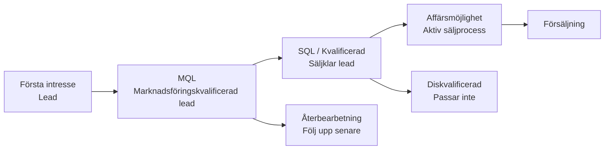

# Leadhantering

Leadhantering hjälper dig att förstå var potentiella kunder befinner sig i sin köpresa och ger marknad och försäljning ett gemensamt, strukturerat sätt att följa intresse, beredskap och utveckling.

Genom att använda kategorier och leadstatus konsekvent kan du se vilka leads som behöver uppmärksamhet nu, vilka som ska vårdas och vilka som är redo att gå vidare i säljprocessen.

Leadinformation visas direkt på företags- och kontaktkort, i detaljkortet **Kontakter**, i urval och i dashboards, vilket gör det enkelt att prioritera nästa steg.

## Leadlivscykel

En lead går vanligtvis igenom flera stadier innan den blir en affärsmöjlighet. SuperOffice använder en kombination av **företagskategori** och **kontaktens leadstatus** för att spegla varje steg. Dessa värden hjälper dig att förstå om en lead är ny, kontaktas, är redo för säljuppföljning eller inte passar.

## Leadstatus

Fältet **Leadstatus** spårar en leads framsteg från första kontakt till kvalificering. Det hjälper sälj- och marknadsföringsteam att prioritera aktiviteter och säkerställer en konsekvent bild av varje leads position i säljtratten.

Leadstatus är endast tillgänglig för kontakter vars företag tillhör en kategori i gruppen **Potentiell kund** med **Aktivera leadstatus** valt.

När denna inställning är aktiv visas fältet direkt under fältet **Kategori** på kontaktkortet. Varje kontakt kan ha sin egen leadstatus, även om flera personer tillhör samma företag. Till exempel kan en person vara *Diskvalificerad* medan en annan är *Kvalificerad* och redo att gå vidare i säljprocessen.

När en ny kontakt skapas för ett företag med leadstatus aktiverad ställs fältet automatiskt in på *Öppen*. Om företagets kategori senare ändras till en som inte använder leadstatus försvinner fältet från vyn, men det senast registrerade värdet behålls. Detta säkerställer att leadinformation förblir sökbar och tillgänglig i dashboards, även när den inte längre är redigerbar i användargränssnittet.

> [!TIP]
> Om du inte ser fältet **Leadstatus** på en kontakt är dess kategori inte en del av gruppen *Potentiell kund*.

### Fördefinierade statusar

Följande statusar är tillgängliga som standard i SuperOffice och representerar viktiga steg i hur en lead kan utvecklas genom kvalificeringsprocessen. [Leadstatusar kan anpassas][2] av administratörer.

| Status | Beskrivning |
|---|---|
| Öppen | Ingen kontakt har gjorts. |
| Kontakt tas | Försäljning försöker nå leadden. |
| Diskvalificerad | Uppfyller inte kriterierna. |
| Återbearbetning | Följ upp senare. |
| Kvalificerad | Redo för säljprocess. |

## Kategorier för potentiella kunder

Fältet **Kategori** på ett företag definierar typen av relation du har med det företaget, såsom *Kund*, *Partner* eller *Lead*. Endast kategorier som tillhör gruppen **Potentiell kund** visar fältet **Leadstatus**.

Gruppering av kategorier efter typ säkerställer att leads hanteras konsekvent:

* **Sökningar och dashboards** kan enkelt filtrera på alla potentiella kunder på en gång.
* **Automatiseringar** kan säkert uppdatera kategorier utan att av misstag nedgradera kunder till leads.
* **Synlighet:** fältet **Leadstatus** visas automatiskt endast där det är relevant.

### Fördefinierade kategorier

Följande kategorier representerar viktiga steg i hur en lead kan utvecklas genom säljtratten. De är tillgängliga som standard i **nya** SuperOffice-databaser version 11.6 och senare. Kategorier kan läggas till och ändras av administratörer.

| Kategori | Beskrivning |
|---|---|
| Lead | Initialt intresse. |
| Marknadsföringskvalificerad lead (MQL) | Matchar målgrupp eller begär mer kontakt. |
| Affärsmöjlighet | Aktiv säljprocess. |
| Förlorad möjlighet | Förlorad affär. |

## Var leadinformation visas

Leadinformation visas på flera platser i SuperOffice CRM, vilket gör det enkelt att se en leads framsteg och vidta åtgärder när det behövs.

* **Kontaktkort:** Fältet **Leadstatus** visas direkt under **Kategori** när företaget använder en kategori för potentiella kunder med leadstatus aktiverad.

    ![Kategori och leadstatus på kontaktkort. -screenshot][img2]

* **Företagskort:** Företagets **Kategori** avgör om kontakter under det företaget kan visa leadstatus.

* **Detaljkortet Kontakter:** Du kan lägga till kolumnerna **Leadstatus**, **Kategori** och **Kategorigrupp** för att sortera, filtrera eller gruppera kontakter baserat på deras leadstadium.

    ![Leadstatus i företagsskärmen. -screenshot][img1]

* **Sökning:** Leadrelaterade fält som **Kategori**, **Kategorigrupp** och **Leadstatus** kan användas för att bygga dynamiska urval för marknadsföring eller lead nurturing.

* **Tavlevy:** Visualisera leads efter status i en kolumnbaserad layout.

* **Dashboards:** Dashboardpaneler kan visa antal eller listor över leads i specifika statusar eller kategorier, vilket hjälper dig att övervaka nya, aktiva eller diskvalificerade leads.

## Relaterat innehåll

* [Arbeta med leads i SuperOffice][4]
* [Konverteringsspårning][5]
* [Konfigurera leadhantering][3] - i Inställningar och underhåll
* [Konfigurera företagskategorier][1]
* [Hantera leadstatusar][2]

<!-- Referenced links -->
[1]: ../admin/add-company-category.md
[2]: ../admin/add-lead-status.md
[3]: ../admin/index.md
[4]: work-with-leads.md
[5]: ../../marketing/utm/learn/index.md

<!-- Referenced images -->
[img1]: ../../../media/loc/en/lead/company-lead-with-contacts-section-tab.png
[img2]: ../../../media/loc/en/lead/contact-card-open-lead.png
