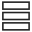
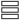

# Aktiviteter

![Aktiviteter i SuperOffice CRM -screenshot][img3]

## Typer

Det finns två typer av aktiviteter – dokument och händelser. Händelser är en samlingsbeteckning för bokningar, uppgifter och samtal. Dessutom visas utskick, formulärinlämningar och chattuppföljningar på detaljkortet **Aktiviteter**.

* [Bokning][1]
* [Uppgift][2]
* [Samtal][3]
* [Arbeta med dokument][4]
* [Skriv ett e-postmeddelande][5]
* [Chatt][12]

Tabellen nedan visar de olika aktivitetstyperna:

<!-- markdownlint-disable MD041 MD033 -->
<table>
<col />
<col />
<col />
<col />
<col />
<col />
<col />
<tr>
<td colspan="7" style="text-align: center;">Aktiviteter</td>
</tr>
<tr>
<td colspan="3" style="text-align: center;">Uppföljningar</td>
<td colspan="2" style="text-align: center;">Dokument</td>
<td rowspan="2" style="text-align: center;">Utskick/formulärinlämningar</td>
<td rowspan="2" style="text-align: center;">Chattsessioner</td>
</tr>
<tr>
<td>
Bokning</td>
<td>
Uppgift</td>
<td>
Samtal</td>
<td>
Dokument
</td>
<td>
E-post</td>
<td rowspan="2" style="text-align: center;">Utskick/formulärinlämningar</td>
<td rowspan="2" style="text-align: center;">Chattsessioner</td>
</tr>
<tr>
</tr>
</table>
<!-- markdownlint-restore -->

## Var hittar jag aktiviteter?

| Plats | Beskrivning | Läs mer |
|---|---|---|
| Fönstret Företag | Visar aktiviteter som är kopplade till företaget. | [Aktiviteter (Företag)][13] |
| Fönstret Kontakt | Visar aktiviteter som är kopplade till kontakten. | [Aktiviteter (Kontakt)][14] |
| Projektskärm | Visar aktiviteter som är kopplade till projektet eller försäljningen. | [Aktiviteter (Projekt)][15] |
| Försäljningsskärm | Visar aktiviteter som är kopplade till projektet eller försäljningen. | [Aktiviteter (Försäljning)][16] |
| Fönstret Kalender | Visar alla oavslutade aktiviteter. | [Aktiviteter (Kalender)][6] |

> [!NOTE]
> Aktiviteter visas även i de [olika vyerna][7] i fönstret Kalender.

## Kolumner

I kolumnerna i aktivitetslistan finns följande information:

* ![ikon][img1]: Den första kolumnen i aktivitetslistan anger **Slutfört**-status för en aktivitet. En bock i kolumnen betyder att aktiviteten är slutförd. Om kolumnen är tom betyder detta att aktiviteten inte är slutförd.

* Kolumnen Kategori innehåller ikoner som anger typ av aktivitet, till exempel en telefon för samtal. De här ikonerna återspeglar texten i kolumnen **Typ**.

* Resten av kolumnerna i aktivitetslistan visar information om aktiviteten. Om du inte ser all text i ett fält kan du hålla muspekaren över texten så visas den i en inforuta.

Vilka aktiviteter som visas beror på vilka kryssrutor du markerar längst ned på detaljkortet.

* Händelser (bokningar, uppgifter och samtal)
* Dokument (e-post, brev och andra dokument)
* Utskick (massutskick med massbrevsmall, e-post eller SMS)
* Annat (chattposter, formulärinlämningar)

Du kan visa alla aktiviteter eller bara en typ av aktivitet.

## Skapa en aktivitet

Du skapar aktiviteter med ![ikon][img2] **Ny** på toppraden, eller genom att dubbelklicka på knappen **Lägg till** på avsnittsfliken.

## Ta bort aktivitete

Du kan ta bort aktiviteter från alla fönster där de visas:

1. Markera en eller flera aktiviteter som du vill ta bort.

2. Högerklicka på den eller de markerade aktiviteterna och välj **Ta bort**.

    > [!NOTE]
    > På fliken **Aktiviteter** kan du också välja aktiviteten och klicka på knappen **Ta bort** till vänster, under listan.
    >
    > Knappen **Ta bort** är endast tillgänglig om användaren som är inloggad har behörighet att ta bort objekt från aktivitetslistan i fråga.

3. En dialogrutan för bekräftelse visas.

## Vad vill du göra nu?

* [Filtrera aktiviteter][17]
* [Ändra Slutfört-status för en aktivitet][10]
* [Lägga till händelser (bokningar, uppgifter och samtal)][8]
* [Ringa till kontakter][11]
* [Arbeta med dokument][4]
* [Skriv ett e-postmeddelande][5]

<!-- Referenced links -->
[1]: ../../diary/learn/appointment.md
[2]: ../../diary/learn/task.md
[3]: ../../diary/learn/phone-call/index.md
[4]: ../../document/learn/index.md
[5]: ../../email/learn/compose.md
[6]: ../../diary/learn/screen/activities-tab.md
[7]: ../../diary/learn/screen/index.md
[8]: ../../diary/learn/create-follow-up.md
[10]: ../../diary/learn/change-completed-status.md
[11]: ../../diary/learn/phone-call/dial.md
[12]: ../index.md
[13]: ../../company/learn/screen/activities-tab.md
[14]: ../../contact/learn/screen/activities-tab.md
[15]: ../../project/learn/screen/activities-project.md
[16]: ../../sale/learn/screen/activities-sale.md
[17]: ../section-tabs/filter.md

<!-- Referenced images -->
[img1]: ../../../media/icons/check.bmp
[img2]: ../../../../common/icons/plus-black.png
[img3]: ../../../media/loc/en/diary/activities-detail.bmp
