# Konverteringsspårning

Marknadsförare har ofta svårt att förstå vilka kampanjer, kanaler eller plattformar som genererar de mest värdefulla leadsen. Utan denna kunskap är det svårt att optimera budgeten eller bevisa avkastning (ROI).

Konverteringsspårning i SuperOffice hjälper dig att koppla marknadsföringsaktiviteter till faktiska resultat. Den använder **UTM-parametrar** för att identifiera var varje lead kommer ifrån och hur besökare interagerar med din webbplats innan de blir kontakter eller affärsmöjligheter.

Genom att spåra källan till varje lead kan du:

* Se exakt var varje lead kom ifrån (t.ex. LinkedIn-annons, nyhetsbrev eller Google-sökning)
* Identifiera vilka kanaler och kampanjer som genererar flest leads och affärer
* Jämföra kampanjresultat och fokusera budgeten på det som fungerar

För att förstå hur UTM-spårning fungerar i detalj, se [UTM-parametrar förklarade][1].

## Datapunkter som spåras i SuperOffice CRM

SuperOffice registrerar flera nyckeldatapunkter för att hjälpa dig förstå hur leads skapas och konverteras.

| Datapunkt | Beskrivning | Lagringsnivå |
|---|---|---|
| **First touch** | Den allra första källan, mediet och kampanjen som fick personen att interagera med företaget. | Kontakt |
| **Lead-skapande** | Källan, mediet och kampanjen som ledde till att leadet faktiskt skapades i CRM. | Kontakt |
| **Konvertering** | Den senaste källan, mediet och kampanjen som fick en befintlig kontakt att skicka in ett nytt formulär. | Formulärinlämning |
| **Företagskälla** | När en ny kontakt läggs till och ett företagskort skapas samtidigt, sparas källan på företagskortet. | Företag |

> [!NOTE]
> First touch, lead-skapande och företagskälla spåras endast för nya kontakter och företag som inte redan finns i CRM.

## Hur leadkällan fångas

En besökare klickar på en **LinkedIn-annons** och landar på din webbplats. När de anländer lagras *first touch-data* – inklusive källa, medium och kampanj – i webbläsaren. Besökaren lämnar webbplatsen utan att agera.

Senare klickar samma person på en **Facebook-annons** och återvänder till webbplatsen. Den här gången fyller de i och **skickar in ett formulär**. När formuläret skickas in fångar SuperOffice källdata från URL:en.

Om inlämningen skapar en ny kontakt eller ett nytt lead i SuperOffice CRM sparas både **first touch** och **lead-skapande** på kontaktkortet.

```mermaid
flowchart TD
    subgraph Journey["Besökarens resa"]
        A["<br/>&#8203;Klickar på LinkedIn-annons<br/> "] --> B["<br/>&#8203;Besöker webbplats<br/> "]
        B --> C["<br/>&#8203;Lämnar webbplats<br/> "]
        C --> D["<br/>&#8203;First touch sparas i webbläsaren<br/> "]
        D --> E["<br/>&#8203;Klickar på Facebook-annons<br/> "]
        E --> F["<br/>&#8203;Besöker webbplats igen<br/> "]
        F --> G["<br/>&#8203;Skickar in formulär<br/> "]
    end

    subgraph CRM["CRM-behandling"]
        G --> H["<br/>&#8203;Källa fångad<br/> "]
        H --> I["<br/>&#8203;Både first touch och lead-skapande sparas i SuperOffice<br/> "]
    end

    style Journey fill:#f5faff,stroke:#c0d9f1,stroke-width:1px
    style CRM fill:#f2fff8,stroke:#a8e0c0,stroke-width:1px
```


<!--Alt-text: Flöde som visar hur first touch och lead-skapande sparas i SuperOffice CRM efter en formulärinlämning.-->

## Visa fångade UTM-data i SuperOffice CRM

När SuperOffice fångar UTM-parametrar från en formulärinlämning är **first touch** och **lead-skapande** synliga i kontaktens **Integritet**-flik under ändamålet *E-marknadsföring*.
Du kan visa dessa skrivskyddade värden genom att klicka på *Visa mer*.

![E-marknadsföringssektionen i Integritet-fliken som visar first touch och lead-skapande UTM-fält -screenshot][img1]

Du kan också visa UTM-data i [detaljkortet **Kontakter**][7] på ett företagskort.

Klicka på <i class="ph ph-gear" aria-label="Gear icon"></i> för att anpassa vilka kolonner som visas.

![Detaljkortet Kontakter som visar lead-kolonner med UTM-data -screenshot][img3]

## Använd UTM-data som sökkriterier

Du kan använda UTM-datafält för att hitta eller segmentera kontakter och företag i SuperOffice CRM.

I **Sök**-fönstret lägger du till kriterier under **Företag** > **Lead** eller **Kontakt** > **Lead**, till exempel:

* First touch-källa
* First touch-kampanj
* Lead-skapandekälla
* Lead-skapandemedium
* Lead-skapandekampanj

![Sök-fönstret som visar UTM-fält tillgängliga som kriterier -screenshot][img2]

Du kan spara dina sökresultat som ett **urval**, som senare kan användas för riktade marknadsföringsaktiviteter eller rapporter.

När du har ett dynamiskt urval av företag eller kontakter kan du också öppna det i [Tavelvyn][6] för att visualisera lead-framsteg.

## Verkliga exempel

### Användningsfall 1: Identifiera vilken kanal som ger flest anmälningar

Du arrangerar ett **webbinarium** och marknadsför det via ett **LinkedIn-inlägg**, en **Google-annons** och ett **nyhetsbrev**.

Efter evenemanget vill du veta:

* Vilken kanal gav flest anmälningar?
* Vilka leads blev senare affärsmöjligheter?

**Rapporter i SuperOffice visar:**

* 50 % av anmälningarna kom från LinkedIn.
* Leads från nyhetsbrevet har 30 % högre konverteringsgrad.

Dessa insikter hjälper dig att justera budget och budskap inför framtida kampanjer.

### Användningsfall 2: Jämför resultat mellan partneraktiviteter

Du kör tre marknadsföringsaktiviteter med olika partners:

* Ett partnernyhetsbrev
* Ett gemensamt webbinarium
* En hänvisningslänk på partnerns webbplats

Du vill veta vilken aktivitet som genererar flest nya leads och affärer.

| Källa | Medium | Leads | Affärer |
|---|---|---|---|
| Partner A | E-post | 30 | 2 |
| Partner B | Webbinarium | 50 | 10 |
| Partner C | Hänvisning | 10 | 1 |

Konverteringsspårning i SuperOffice hjälper dig att jämföra partnerresultat och fokusera på det som ger mätbara resultat.

## Exempel på spårningslänk

Du kan lägga till UTM-parametrar i alla kampanjslänkar för att identifiera trafikkällor.

```text
https://yourcompany.com/signup?utm_source=linkedin&utm_medium=social&utm_campaign=webinar_sept
```

Använd UTM-byggaren för SuperOffice-formulär för att skapa kampanjslänkar med konsekventa namn.

## Relaterat innehåll

* [UTM-parametrar förklarade][1]
* [Aktivera UTM-spårning för formulärinlämningar][3] i Inställningar och underhåll
* [UTM-byggare för SuperOffice-formulär][2]
* [Leadpaneler och rapporter][5]
* [Leadhantering][8]

[1]: parameters.md
[2]: ../../forms/learn/publish.md
[3]: ../admin/set-up.md
[5]: ../../../dashboard/learn/show-leads.md
[6]: ../../../search-options/selection/learn/board-view.md
[7]: ../../../learn/section-tabs/contacts-tab.md
[8]: ../../../lead/learn/index.md

<!-- Referenced images -->
[img1]: ../../../../media/loc/en/marketing/contact-privacy-utm-data.png
[img2]: ../../../../media/loc/en/search-options/lead-utm-criteria.png
[img3]: ../../../../media/loc/en/marketing/lead-in-contact-section-tab.png
