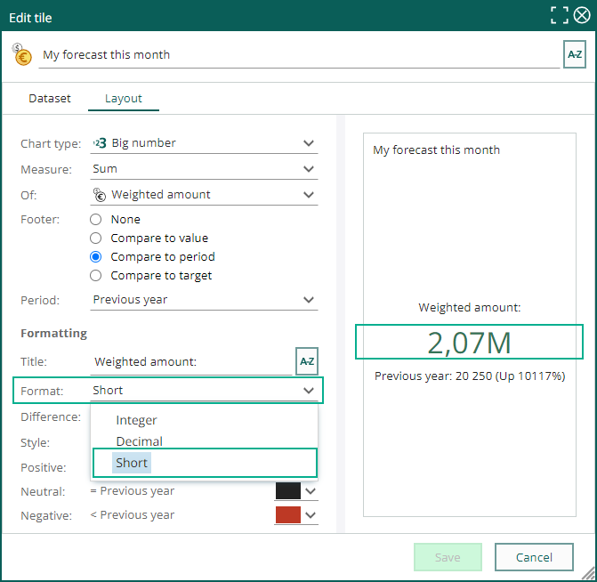

# Core CRM 10.1.5 update

## Sale - Quote approval and notification in Mobile CRM

When working with **sales and quotes**, you sometimes add a higher discount rate that is wanted, and you need someone else to approve the sale. 

You send the **quote approval request** to your manager or another employee. If that person use Mobile CRM, he/she gets a notifiction about this approval in the app, and it’s easy for them to **approve** or **deny** the approval.

You, as the sales owner, get a notification about the approval, if it was approved or denied, in your own Mobile CRM app. Like that, it takes less time for the sale to get going and you can send out the quote if approved, or changed the discount if denied.

See more on the Mobile CRM section: [Notifications – Notifications for Quote approval (10.2.2)][1].

This feature requires SuperOffice CRM v10.1.5 or newer and Mobile CRM v10.2.2 or newer.

![icon][img1]

## Dashboard – Preview of criteria

Have you sometimes wondered about the **criteria** or **dataset** behind a dashboard tile?

Click the **Task** menu and select **Show dataset** to see the different criteria used on the tile.

![icon][img3]

## Dashboard – Copy a tile to a different dashboard

Creating tiles can sometimes be a little time consuming. And if you want that same tile to appear on multiple dashboards, its very neat to have the option to copy the finished tile to a different dashboard.

Simply finetune your tile to wanted layout and dataset, click the **Task** button and select **Copy tile to dashboard** and select the other dashboard you want the tile to appear.

![icon][img4]

## Dashboard – Big number tile with short number

Using the tile for **big number** is very visual to see the actual amount or number of a certain entity.

But if the company have very large numbers to display here, it’s sometimes hard to read the number and also have space to the whole number.

Use on **Format** the **Short number**, and you get the number in millions. It don’t take that much space and easier to read and compare to other numbers.

<!-- Referenced links-->
[1]: ../mobile/10.2.2-update.md

<!-- Referenced images -->
[img1]: media/sale-5-quote-approval.png
[img2]: ../mobile/media/mobile-2-2-quote-approval-2.png
[img3]: media/dashboard-5-preview-criteria.png
[img4]: media/dashboard-5-copy-tile-dashboard.png
[img5]: media/dashboard-5-big-number-short-format.png
