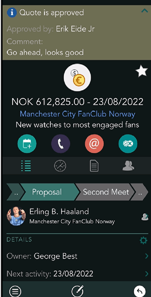
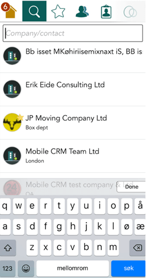

# SuperOffice Mobile CRM 10.2.2 update

## Notifications – Notifications for Sale Quote approval

In Mobile CRM you will now be notified if someone needs **approval** for their Sale Quote to be sent to customer. You can see all the important details about the sale in Mobile CRM and **Approve** or **Deny** the Sale Quote. The person who issued the approval will get notified immediately. This makes the Quote Approval flow easy and without any friction. The sale must go on :-).

Read more about it in chapter:
[Sale – Quote approval and notification in Mobile CRM (10.1.5)][1]

This feature requires SuperOffice CRM v10.1.5 or newer and Mobile CRM v10.2.2 or newer.

  

## Search – Search for anything

The search engine for Company/Contact, Sale and Project gives you the option to search for any property within an entity, like phone number, e-mail address, project number etc.
You start the search from the "Search" button on your keyboard which is closer to your thumb.

<!-- Referenced links-->
[1]: ../core-crm/10.1.5-update.md

<!-- Referenced images -->
[img1]: media/mobile-2-2-quote-approval-1.png
[img2]: media/mobile-2-2-quote-approval-2.png
[img3]: media/mobile-2-2-quote-approval-3.png
[img4]: media/mobile-2-2-search.png
