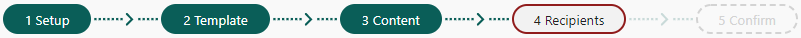

# Create new mailing

In this topic, we will show you how to create a mailing.

You can create a new mailing either directly in SuperOffice Marketing, or as a mail-merge from a selection in SuperOffice CRM.

## The mailing workflow

When creating a mailing, you follow a workflow consisting of 5 steps:

* **Setup**
* **Template** (this step is skipped if you are creating the mailing from a template or an existing mailing)
* **Content**
* **Recipients** (not applicable for forms)
* **Confirm** (not applicable for forms)

**Green** = Complete step | **Red** = Incomplete or skipped step | Grey/dotted = Step not started

Each step in the workflow must be completed before you can move on to the next. You can, however, click on complete steps to make changes before sending the mailing.

## Select mailing type

The first thing you must do, is to select what type of mailing you want to send.

> [!NOTE]
> If you initiated the mailing as a mail merge from SuperOffice CRM, you have already chosen the mailing type. You are automatically directed to the **Setup** step.

To do this:

1. Select the **Mailings** tab.
2. Select one of the following options under **Create new mailing** on the right side of the screen:
    * **E-mail**
    * **SMS**
    * **Document**
    * **Form response**

> [!NOTE]
> E-mail mailings and form responses are the most feature-rich of these mailing types. Features such as tracked links and subscription links are not available in SMS mailings and document mailings.

You have now started the workflow to create a mailing. The first step is called **Setup**. Depending on the type of mailing you have selected, go to either of these topics:

[Step 1: Setup - E-mail](step_1_setup_email.md)

[Step 1: Setup - SMS](Step_1__Setup_-_SMS.md)

[Step 1: Setup - Document](Step_1_Setup_-_Document.md)

[Step 1: Setup - Form response](form_create_step1_setup.md)

## What would you like to do now?

[Define settings for mailings](define_settings_for_mailings.md)

[Follow up mailings](Followup_mailings.md)
