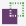

# Navigate in SuperOffice Service

To move between the parts in SuperOffice Service, you click the buttons in the Navigator on the left of the screen.

<!-- Fix reuse ID=a1 -->

  
 Try the shortcut search

## Shortcut search

To quickly access a specific record (such as a request or contact), function or screen in SuperOffice Service, use the "shortcut search":

1. Press **CTRL+SPACE** on your keyboard. The shortcut popup shows a fast searcher and all available menu items from the navigator, personal settings and system settings.
2. Enter a search term, such as a function name, request ID, contact name or menu item. The result updates dynamically as you type.
3. Select the result you want to open.

> [!TIP]
> You can also use the [keywords used in the quick search](rms.search.useQuickSearch.md#SearchForOtherRecords) to search for specific items like contacts or companies.

When you click one of these buttons, you get access to various options, such as shortcuts, actions, history, favourites and search. See [Navigator options](Navigator_options.md).

| Button | Description |
|---|---|
|  | **Dashboard**: The dashboard provides you with an overview that can be tailored to your needs. See [Dashboard](ticket.mainMenu.md). |
|  | **Requests**: This is where you manage requests and enquiries that are in the system. You can also create internal and external requests, respond to incoming enquiries and obtain an overview of the statuses of all requests in the system. See [Requests](ticket.md). |
|  | **Customers**: Here you can search for and create companies and contacts. See [Customers](customers.md). |
|  | **Selections**: You use selections to save a set of records, such as a set of requests or contacts that you want to work with later on and elsewhere in the system. See [Selections](selections.md). |
|  | **Knowledge Base**: The knowledge base gives request handlers access to saved data in a single location, which makes it easier to acquire and organise information for the customer. Among other things, it contains FAQs and reply templates. See [Knowledge Base](document.md). |
|  | **Statistics**: Here you can run standard reports and create new reports. See [Statistics](stat.md). |
|  | **Marketing**: From here you can create and send mailings (e-mails, SMS and documents) and create and publish forms. See [Getting started](../../Mailing/Helptopics/The_mailing_workflow.md). |
|  | **Chat**: Opens the **Chat** screen, where you can respond to inquiries sent via the chat function on you company's web page. See [Chat](../../Chat/Chat.md). |

## See also

[Navigator options](Navigator-options.md)

[Buttons in the Top bar](rms.navigate.buttons.topbar.md)

[Global buttons](rms.navigate.buttons.md)
