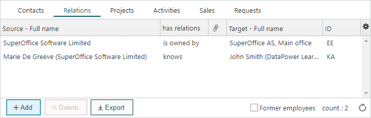

# Relations (Company screen)

The **Relations** section tab displays any connections existing between companies and/or contacts, for example, information about ownership structure or about people who have been employed in different companies.

The columns of the **Relations** section tab contain the following information:

* Names of the companies (and any contacts) defined as parties to the relation.
* What relation they have to each other.
* Who created the relation.
* If a paperclip symbol (  ) is displayed, this indicates that there is a more detailed description of the relation in the **Relation** dialog.

Double-click on a relation row and the **Relation** dialog opens, showing all the information entered for that relation (see [Add relations](Adding_relations.md)).

## What would you like to do now?

[Add relations](Adding_relations.md)

[Delete relations](Deleting_relations.md)
