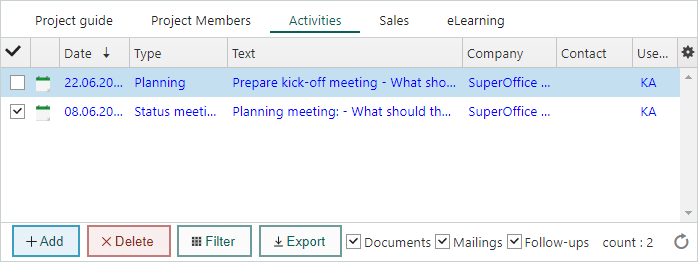

# Activities

The **Activities** section tab shows all activities that are linked to the active project, i.e. follow-ups (appointments, tasks and phone calls) and documents (including merge documents, reports and e-mail).

Double-click an activity in the section tab to view or edit it, as required.

> [!NOTE]
> Activities are described in more detail under [Activities in SuperOffice CRM](../chap02/Activities_in_SuperOffice_CRM.md).

### Columns in the Activities section tab

**Completed status** 

The first column in the **Activities** section tab indicates the **Completed** status of an activity. A tick in the checkbox () means that the activity is completed, while an empty box means that it is not completed. For more details on the **Completed** status, see [Change Completed status of an activity](../chap02/Marking_activities_as_completed_not_completed.md).

Type icons

The second column contains icons that indicate the type of activity, for example, a clock for an appointment and a telephone for a call. These icons reflect the text in the **Type** column.

<!-- Fix reuse ID=a1 -->

<table style=" vertical-align:top; margin-top:10px; margin-bottom:10px; left:0px; top:0px; width:100%; max-width:417px;" data-cellspacing="0">
<tbody>
<tr>
<td>

</td>
<td>
Appointment
</td>
</tr>
<tr>
<td>

</td>
<td>
Task
</td>
</tr>
<tr>
<td>

</td>
<td>
Phone Call
</td>
</tr>
<tr>
<td>

</td>
<td>
Document/report
</td>
</tr>
<tr>
<td>

</td>
<td>
E-mail
</td>
</tr>
<tr>
<td>

</td>
<td>
Mailing
</td>
</tr>
<tr>
<td>

</td>
<td>
Chat conversation
</td>
</tr>
</tbody>
</table>

Date

Shows the date the activity was created or completed, depending on the type of activity in question.

* Documents: Shows the date when the document was recorded.

* Follow-ups: Shows the date when the follow-up takes place.

Type

Shows the type of activity and matches the above-mentioned type icons.

Text

A description of the activity.

Company

Shows any company the activity is linked to.

Contact

Shows any contact included in the activity.

User ID

Shows the user ID of the person who created the activity.

## What would you like to do now?

[View activities](../chap03/Viewing_activities.md)

[Delete activities](../chap03/Deleting_activities_Contact.md)

[Reply to e-mail from the Activities section tab](../chap03/Replying_to_e-mail_from_the_Activities_section_tab.md)

[Forward e-mail from the Activities section tab](../chap03/Forwarding_e-mail_from_the_Activities_section_tab.md)

[Filter activities](../chap03/Using_the_Filter_function_Contact.md)
