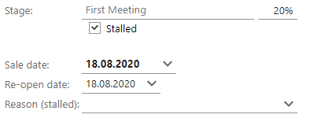

# Stalled, sold and lost sales

In the **Stage** field in the **Sale** screen, you can set the sale to **Sold** or **Lost**. You can also check the **Stalled** checkbox below this field if you want put the sales process on hold. If you do this, the fields underneath change, along with the icon at the top left of the **Sale** screen.

For individual sale types, a list of stages, as defined in SuperOffice Settings and maintenance, is also displayed. To find out more about these, see the [Sales guide](sales_guide.md).

<table style=" border-collapse:separate; width:100%; max-width:75.054%;" data-cellspacing="0" data-border="1">

<tbody>
<tr>
<td>
These statuses …
</td>
<td>
... produce these fields in the Sale screen
</td>
</tr>
<tr>
<td>
Open 
</td>
<td>

</td>
</tr>
<tr>
<td>
Stalled 
</td>
<td>

</td>
</tr>
<tr>
<td>
Lost 
</td>
<td>

</td>
</tr>
<tr>
<td>
Sold 
</td>
<td>

</td>
</tr>
</tbody>
</table>

Stalled

If you set the sales to **Stalled**, the following fields are displayed:

* **Re-open date**: Here you can enter the date when the sale should be reopened.
* **Reason (stalled)**: Here you can enter the reason for the delay.

In addition, the **Appointment** dialog opens when you click **Save**. Here you can set up a future meeting or phone call to follow up the stalled sale.

Sold/Lost

If you set the sale to **Sold** or **Lost**, you can enter the date, any competitor and the reason why the sale succeeded or failed.

## Related topics

[Enter information in the Sale tab](CreateSale_Sale-tab.md)

[Sales guide](sales_guide.md)
